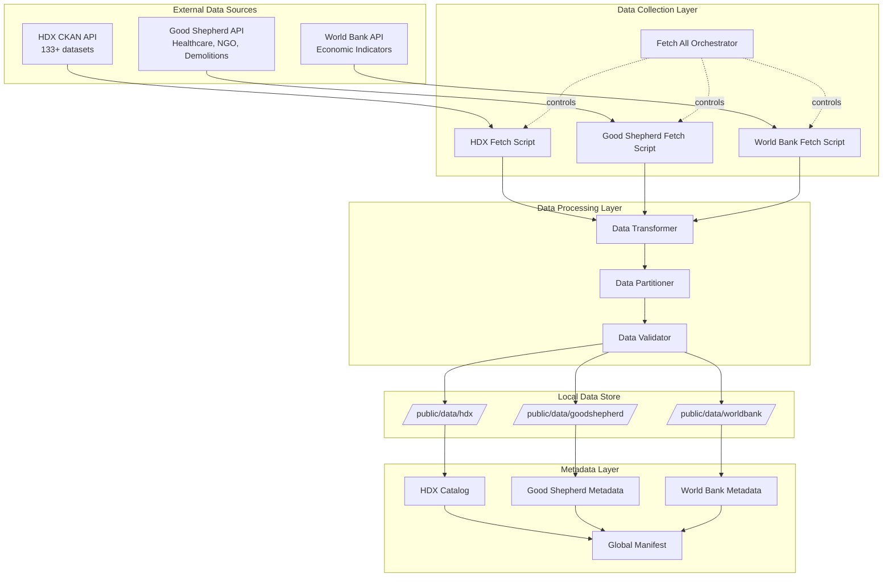
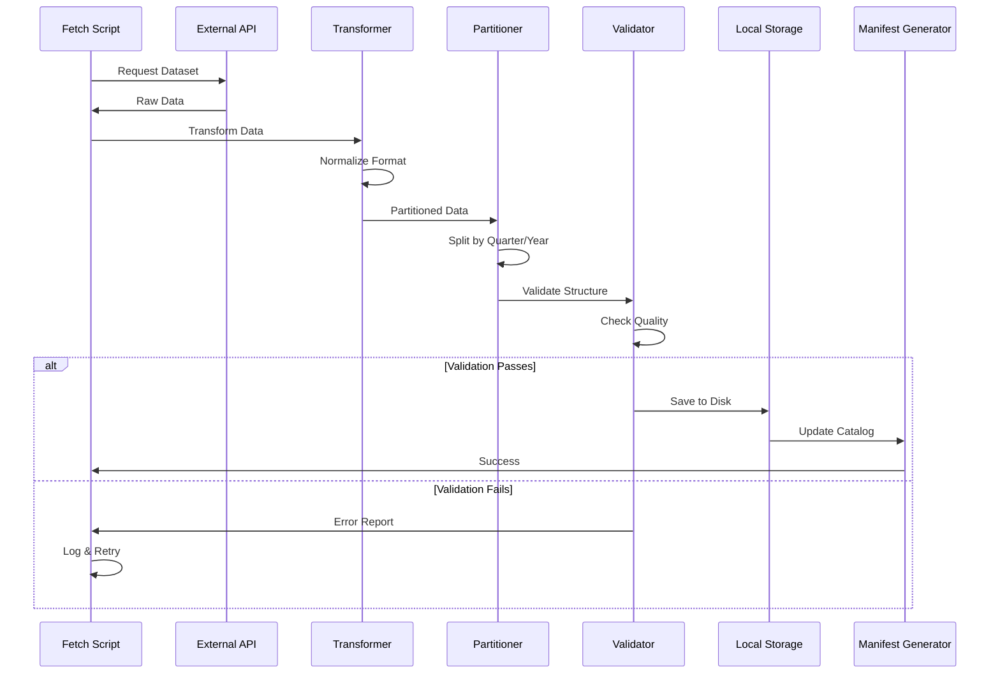

# Data Collection Expansion Design

## Overview

This design addresses the need to expand local data collection beyond the initial Tech4Palestine and Good Shepherd prisoner datasets. The solution systematically downloads 30-40 additional HDX datasets, completes Good Shepherd data categories, and expands World Bank economic indicators. The design focuses on reliable, automated data collection with proper partitioning, transformation, and validation.

## Architecture

### High-Level Architecture



### Data Collection Flow



## Components and Interfaces

### 1. Enhanced HDX Fetch Script

**Purpose**: Download and process 30-40 priority HDX datasets with proper error handling and validation.

**File**: `scripts/fetch-hdx-ckan-data.js`

**Interface**:
```typescript
interface HDXFetchScript {
  fetchPriorityDatasets(): Promise<HDXFetchResult>;
  fetchDatasetByCategory(category: HDXCategory): Promise<DatasetResult>;
  transformHDXData(rawData: any, datasetType: string): TransformedData;
  partitionHDXData(data: TransformedData): PartitionedData;
  validateHDXData(data: TransformedData): ValidationResult;
}

interface HDXFetchResult {
  totalDatasets: number;
  successfulDownloads: number;
  failedDownloads: FailedDownload[];
  totalRecords: number;
  storageSize: number;
}

interface HDXCategory {
  name: 'conflict' | 'education' | 'water' | 'infrastructure' | 'refugees' | 'humanitarian';
  datasetIds: string[];
  priority: number;
}
```

**Priority Datasets**:
```javascript
const PRIORITY_HDX_DATASETS = {
  conflict: [
    'acled-conflict-data-for-palestine',
    'violent-events-palestine',
    'conflict-incidents-gaza',
    // 10+ conflict datasets
  ],
  education: [
    'education-facilities-palestine',
    'school-damage-assessment',
    'education-access-data',
    // 5+ education datasets
  ],
  water: [
    'water-sanitation-access',
    'water-infrastructure-damage',
    // 3+ water datasets
  ],
  infrastructure: [
    'infrastructure-damage-assessment',
    'building-destruction-data',
    // 5+ infrastructure datasets
  ],
  refugees: [
    'refugee-statistics-palestine',
    'displacement-tracking',
    // 3+ refugee datasets
  ],
  humanitarian: [
    'humanitarian-needs-overview',
    'humanitarian-response-plan',
    // 5+ humanitarian datasets
  ]
};
```

### 2. Enhanced Good Shepherd Fetch Script

**Purpose**: Complete Good Shepherd data collection for healthcare, NGO, and demolitions categories.

**File**: `scripts/fetch-goodshepherd-data.js`

**Interface**:
```typescript
interface GoodShepherdFetchScript {
  fetchHealthcareAttacks(): Promise<HealthcareData>;
  fetchNGOFinancial(): Promise<NGOData>;
  fetchDemolitions(): Promise<DemolitionData>;
  partitionByQuarter(data: any[], category: string): QuarterPartitions;
  generateRecentFile(data: any[], days: number): RecentData;
}

interface HealthcareData {
  totalAttacks: number;
  facilities: HealthcareFacility[];
  casualties: number;
  dateRange: DateRange;
  partitions: QuarterPartition[];
}

interface NGOData {
  totalOrganizations: number;
  totalFunding: number;
  organizations: NGOOrganization[];
  fundingByYear: Record<string, number>;
}

interface DemolitionData {
  totalDemolitions: number;
  structures: DemolishedStructure[];
  affectedPeople: number;
  dateRange: DateRange;
  partitions: QuarterPartition[];
}
```

**Data Structure**:
```
/public/data/goodshepherd/
├── healthcare/
│   ├── 2023-Q1.json
│   ├── 2023-Q2.json
│   ├── 2024-Q3.json
│   ├── recent.json (last 90 days)
│   └── index.json
├── ngo/
│   ├── organizations.json
│   ├── funding-by-year.json
│   └── index.json
├── demolitions/
│   ├── 2023-Q1.json
│   ├── 2024-Q4.json
│   ├── recent.json
│   └── index.json
└── metadata.json
```

### 3. Enhanced World Bank Fetch Script

**Purpose**: Expand World Bank indicator collection from 40 to 60+ indicators.

**File**: `scripts/fetch-worldbank-data.js`

**Interface**:
```typescript
interface WorldBankFetchScript {
  fetchAdditionalIndicators(): Promise<IndicatorFetchResult>;
  fetchIndicatorData(indicatorCode: string): Promise<IndicatorData>;
  transformWorldBankData(rawData: any): TransformedIndicatorData;
  updateIndicatorCatalog(indicators: IndicatorData[]): void;
}

interface IndicatorFetchResult {
  totalIndicators: number;
  newIndicators: number;
  failedIndicators: string[];
  dataPoints: number;
}
```

**Additional Indicators**:
```javascript
const ADDITIONAL_INDICATORS = {
  poverty: [
    'SI.POV.DDAY',    // Poverty headcount ratio at $2.15/day
    'SI.POV.GAPS',    // Poverty gap at $2.15/day
    'SI.POV.LMIC',    // Poverty headcount ratio at $3.65/day
    // 5+ poverty indicators
  ],
  trade: [
    'TG.VAL.TOTL.GD.ZS',  // Merchandise trade (% of GDP)
    'BN.CAB.XOKA.GD.ZS',  // Current account balance (% of GDP)
    'BX.GSR.GNFS.CD',     // Exports of goods and services
    // 5+ trade indicators
  ],
  infrastructure: [
    'EG.ELC.LOSS.ZS',     // Electric power transmission losses
    'IS.ROD.PAVE.ZP',     // Roads, paved (% of total roads)
    'IT.MLT.MAIN.P2',     // Fixed telephone subscriptions
    // 5+ infrastructure indicators
  ],
  social: [
    'SH.STA.SUIC.P5',     // Suicide mortality rate
    'SH.PRV.SMOK',        // Smoking prevalence
    'SP.DYN.CDRT.IN',     // Death rate, crude
    // 5+ social indicators
  ]
};
```

### 4. Data Transformation Service

**Purpose**: Standardize data formats across all sources for consistent dashboard consumption.

**Interface**:
```typescript
interface DataTransformationService {
  transformToStandardFormat(rawData: any, sourceType: DataSource): StandardizedData;
  normalizeDateFormats(data: any[]): any[];
  standardizeGeographicIdentifiers(data: any[]): any[];
  addMetadataFields(data: any, metadata: DatasetMetadata): EnrichedData;
}

interface StandardizedData {
  source: DataSource;
  dataset: string;
  version: string;
  lastUpdated: string;
  recordCount: number;
  dateRange: DateRange;
  data: any[];
  metadata: DatasetMetadata;
}

interface DatasetMetadata {
  title: string;
  description: string;
  source: string;
  sourceUrl: string;
  license: string;
  updateFrequency: string;
  coverage: GeographicCoverage;
}
```

### 5. Data Partitioning Service

**Purpose**: Split large datasets into manageable time-based chunks for efficient loading.

**Interface**:
```typescript
interface DataPartitioningService {
  partitionByQuarter(data: any[], dateField: string): QuarterPartitions;
  partitionByYear(data: any[], dateField: string): YearPartitions;
  generateRecentFile(data: any[], days: number): RecentData;
  createPartitionIndex(partitions: Partition[]): PartitionIndex;
}

interface QuarterPartitions {
  partitions: QuarterPartition[];
  index: PartitionIndex;
}

interface QuarterPartition {
  quarter: string; // "2024-Q3"
  recordCount: number;
  dateRange: DateRange;
  filePath: string;
  data: any[];
}

interface PartitionIndex {
  totalPartitions: number;
  partitions: PartitionInfo[];
  recentFile: string;
  dateRange: DateRange;
}
```

**Partitioning Rules**:
- Datasets > 1000 records: Partition by quarter
- Datasets > 10000 records: Partition by month
- Always create `recent.json` with last 90 days
- Always create `index.json` listing all partitions

### 6. Data Validation Service

**Purpose**: Ensure downloaded data meets quality standards before saving.

**Interface**:
```typescript
interface DataValidationService {
  validateDataStructure(data: any, schema: DataSchema): ValidationResult;
  validateDataCompleteness(data: any[], requiredFields: string[]): CompletenessResult;
  validateDataQuality(data: any[]): QualityResult;
  generateValidationReport(results: ValidationResult[]): ValidationReport;
}

interface ValidationResult {
  isValid: boolean;
  errors: ValidationError[];
  warnings: ValidationWarning[];
  qualityScore: number;
}

interface ValidationError {
  field: string;
  message: string;
  severity: 'critical' | 'error' | 'warning';
  affectedRecords: number;
}

interface QualityResult {
  completeness: number;      // % of non-null required fields
  consistency: number;        // % of records with valid formats
  accuracy: number;           // % of records passing validation rules
  overallScore: number;       // Weighted average
}
```

**Validation Rules**:
```javascript
const VALIDATION_RULES = {
  requiredFields: {
    casualties: ['date', 'killed', 'injured'],
    demolitions: ['date', 'location', 'structures'],
    healthcare: ['date', 'facility_name', 'incident_type'],
  },
  dateFormats: ['YYYY-MM-DD', 'YYYY-MM-DDTHH:mm:ss'],
  numericRanges: {
    killed: { min: 0, max: 100000 },
    injured: { min: 0, max: 500000 },
  },
  qualityThresholds: {
    completeness: 0.95,  // 95% of required fields must be present
    consistency: 0.90,   // 90% of records must have valid formats
    accuracy: 0.85,      // 85% must pass validation rules
  }
};
```

### 7. Manifest Generation Service

**Purpose**: Create comprehensive catalogs of all available local datasets.

**Interface**:
```typescript
interface ManifestGenerationService {
  generateGlobalManifest(): GlobalManifest;
  generateSourceManifest(source: DataSource): SourceManifest;
  updateManifest(source: DataSource, datasets: Dataset[]): void;
}

interface GlobalManifest {
  version: string;
  lastUpdated: string;
  sources: SourceSummary[];
  totalDatasets: number;
  totalRecords: number;
  storageSize: number;
}

interface SourceManifest {
  source: DataSource;
  datasets: DatasetInfo[];
  categories: CategoryInfo[];
  lastUpdated: string;
  totalRecords: number;
}

interface DatasetInfo {
  id: string;
  name: string;
  category: string;
  recordCount: number;
  dateRange: DateRange;
  partitioned: boolean;
  partitions?: PartitionInfo[];
  filePath: string;
  metadata: DatasetMetadata;
}
```

## Data Models

### HDX Dataset Configuration

```typescript
interface HDXDatasetConfig {
  datasetId: string;
  category: HDXCategory;
  priority: number;
  resourceIndex: number;  // Which resource to download from dataset
  transformationType: 'casualties' | 'infrastructure' | 'humanitarian' | 'generic';
  partitionStrategy: 'quarter' | 'year' | 'none';
  requiredFields: string[];
}
```

### Good Shepherd Data Models

```typescript
interface HealthcareFacility {
  id: string;
  name: string;
  type: 'hospital' | 'clinic' | 'pharmacy' | 'ambulance';
  location: Location;
  attackDate: string;
  attackType: string;
  casualties: number;
  damage: 'destroyed' | 'damaged' | 'minor';
}

interface NGOOrganization {
  id: string;
  name: string;
  type: string;
  sector: string[];
  funding: number;
  fundingYear: number;
  location: string;
  beneficiaries: number;
}

interface DemolishedStructure {
  id: string;
  date: string;
  location: Location;
  structureType: 'residential' | 'commercial' | 'agricultural' | 'public';
  peopleAffected: number;
  reason: string;
  demolishedBy: string;
}
```

### World Bank Indicator Model

```typescript
interface WorldBankIndicator {
  indicatorCode: string;
  indicatorName: string;
  category: 'poverty' | 'trade' | 'infrastructure' | 'social' | 'economic';
  unit: string;
  dataPoints: DataPoint[];
  lastUpdated: string;
}

interface DataPoint {
  year: number;
  value: number;
  countryCode: string;
  countryName: string;
}
```

## Error Handling

### Error Categories

1. **API Errors**
   - Network connectivity failures
   - API rate limit exceeded
   - Authentication failures
   - Invalid dataset IDs

2. **Data Processing Errors**
   - Invalid data format
   - Missing required fields
   - Data transformation failures
   - Partition creation failures

3. **Storage Errors**
   - Disk space insufficient
   - File write permissions
   - Path creation failures

### Error Handling Strategy

```typescript
interface ErrorHandlingStrategy {
  retryPolicy: {
    maxRetries: 3;
    backoffMultiplier: 2;
    initialDelay: 1000;
  };
  fallbackBehavior: {
    onAPIFailure: 'skip' | 'retry' | 'fail';
    onValidationFailure: 'skip' | 'save_with_warning' | 'fail';
    onStorageFailure: 'retry' | 'fail';
  };
  logging: {
    logLevel: 'error' | 'warn' | 'info' | 'debug';
    logFile: string;
    includeStackTrace: boolean;
  };
}
```

**Retry Logic**:
```javascript
async function fetchWithRetry(url, options, maxRetries = 3) {
  for (let attempt = 1; attempt <= maxRetries; attempt++) {
    try {
      const response = await fetch(url, options);
      if (response.ok) return response;
      
      if (response.status === 429) {
        // Rate limit - exponential backoff
        const delay = Math.pow(2, attempt) * 1000;
        await sleep(delay);
        continue;
      }
      
      throw new Error(`HTTP ${response.status}`);
    } catch (error) {
      if (attempt === maxRetries) throw error;
      console.warn(`Attempt ${attempt} failed, retrying...`);
      await sleep(1000 * attempt);
    }
  }
}
```

## Testing Strategy

### Testing Levels

1. **Unit Testing**
   - Data transformation functions
   - Partitioning logic
   - Validation rules
   - Manifest generation

2. **Integration Testing**
   - End-to-end fetch scripts
   - API connectivity
   - File system operations
   - Manifest updates

3. **Data Quality Testing**
   - Validation rule effectiveness
   - Data completeness checks
   - Format consistency
   - Partition integrity

### Test Data

```javascript
const TEST_DATASETS = {
  hdx: {
    small: 'test-dataset-100-records',
    medium: 'test-dataset-1000-records',
    large: 'test-dataset-10000-records',
  },
  goodshepherd: {
    healthcare: 'test-healthcare-attacks',
    ngo: 'test-ngo-data',
    demolitions: 'test-demolitions',
  },
  worldbank: {
    indicators: ['SI.POV.DDAY', 'NY.GDP.MKTP.CD'],
  }
};
```

## Performance Considerations

### Optimization Strategies

1. **Parallel Downloads**
   - Download multiple datasets concurrently
   - Limit concurrent requests to respect rate limits
   - Use connection pooling

2. **Efficient Storage**
   - Compress large JSON files
   - Use streaming for large datasets
   - Minimize memory usage during processing

3. **Progress Tracking**
   - Show download progress
   - Estimate time remaining
   - Report success/failure in real-time

**Performance Targets**:
- Download 30-40 HDX datasets: < 10 minutes
- Process and partition data: < 5 minutes
- Generate manifests: < 1 minute
- Total execution time: < 20 minutes

## Implementation Phases

### Phase 1: HDX Expansion (Priority: HIGH)
- Update fetch-hdx-ckan-data.js with priority datasets
- Implement category-based downloading
- Add proper transformation for each dataset type
- Create organized folder structure
- Update HDX catalog

### Phase 2: Good Shepherd Completion (Priority: HIGH)
- Add healthcare attacks download
- Add NGO financial data download
- Add demolitions data download
- Implement quarter-based partitioning
- Generate recent.json files

### Phase 3: World Bank Expansion (Priority: MEDIUM)
- Add 20+ additional indicators
- Update fetch script with new indicator codes
- Maintain existing data structure
- Update all-indicators.json catalog

### Phase 4: Validation & Quality (Priority: HIGH)
- Implement comprehensive validation
- Add data quality scoring
- Generate validation reports
- Add automated testing

## Success Criteria

### Data Collection
- 30-40 HDX datasets downloaded successfully
- All Good Shepherd categories complete
- 60+ World Bank indicators available
- All data properly partitioned

### Data Quality
- Validation pass rate > 95%
- Data completeness > 95%
- No critical validation errors
- All manifests accurate

### Performance
- Total collection time < 20 minutes
- No memory issues during processing
- Efficient storage usage
- Reliable error recovery

### Maintainability
- Clear logging and error messages
- Comprehensive documentation
- Easy to add new datasets
- Automated testing coverage
