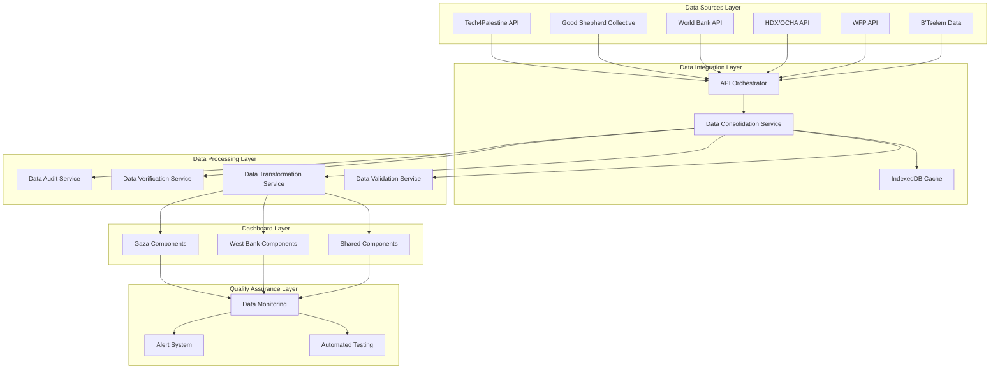
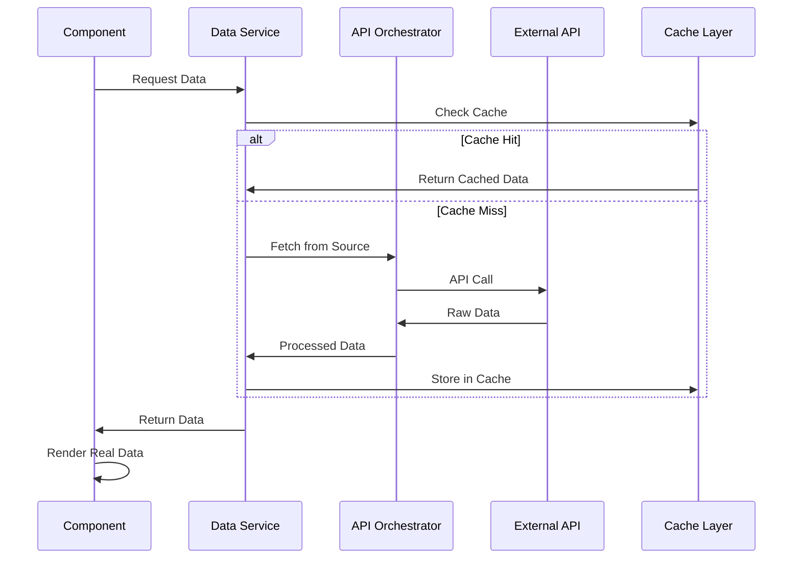

# Real Data Integration Design

## Overview

This design addresses the critical data authenticity problem in the Palestine Pulse dashboard by systematically replacing all fake/hardcoded data with real data from verified sources. The solution involves a comprehensive audit, verification, and replacement process that leverages the existing data infrastructure while ensuring data quality and reliability.

## Architecture

### High-Level Architecture



### Data Flow Architecture



## Components and Interfaces

### 1. Data Audit Service

**Purpose**: Systematically identify and catalog all fake data instances in the dashboard.

**Interface**:
```typescript
interface DataAuditService {
  auditComponent(componentPath: string): FakeDataReport;
  auditAllComponents(): ComprehensiveAuditReport;
  identifyHardcodedValues(code: string): HardcodedValue[];
  generateReplacementPlan(auditReport: FakeDataReport): ReplacementPlan;
}

interface FakeDataReport {
  componentPath: string;
  fakeDataInstances: FakeDataInstance[];
  severity: 'critical' | 'high' | 'medium' | 'low';
  replacementComplexity: number;
}

interface FakeDataInstance {
  location: string;
  type: 'hardcoded_number' | 'mock_calculation' | 'placeholder_text' | 'fake_array';
  currentValue: any;
  suggestedReplacement: string;
  dataSourceMapping: string[];
}
```

### 2. Data Source Verification Service

**Purpose**: Test and verify all existing data source APIs to confirm functionality and data availability.

**Interface**:
```typescript
interface DataSourceVerificationService {
  verifyAllSources(): Promise<SourceVerificationReport>;
  testSourceConnectivity(source: DataSource): Promise<ConnectivityResult>;
  validateDataStructure(source: DataSource, endpoint: string): Promise<StructureValidation>;
  benchmarkDataQuality(source: DataSource): Promise<QualityMetrics>;
}

interface SourceVerificationReport {
  totalSources: number;
  workingSources: number;
  failingSources: DataSource[];
  dataGaps: DataGap[];
  qualityAssessment: Record<DataSource, QualityMetrics>;
}

interface DataGap {
  requiredData: string;
  availableSources: DataSource[];
  alternativeSources: DataSource[];
  severity: 'blocking' | 'workaround_available' | 'minor';
}
```

### 3. Component Data Mapping Service

**Purpose**: Create comprehensive mappings between dashboard components and real data sources.

**Interface**:
```typescript
interface ComponentDataMappingService {
  createComponentMapping(componentPath: string): ComponentDataMapping;
  generateGlobalMapping(): GlobalDataMapping;
  validateMapping(mapping: ComponentDataMapping): ValidationResult;
  optimizeDataFlow(mapping: GlobalDataMapping): OptimizedDataFlow;
}

interface ComponentDataMapping {
  componentPath: string;
  metrics: MetricMapping[];
  dataDependencies: DataDependency[];
  transformationRequirements: TransformationSpec[];
}

interface MetricMapping {
  metricName: string;
  currentImplementation: 'fake' | 'real' | 'mixed';
  targetDataSource: DataSource;
  transformationRequired: boolean;
  replacementPriority: number;
}
```

### 4. Real Data Integration Service

**Purpose**: Systematically replace fake data with real data from verified sources.

**Interface**:
```typescript
interface RealDataIntegrationService {
  replaceComponentData(componentPath: string, mapping: ComponentDataMapping): Promise<IntegrationResult>;
  integrateGazaData(): Promise<GazaIntegrationResult>;
  integrateWestBankData(): Promise<WestBankIntegrationResult>;
  validateIntegration(componentPath: string): Promise<ValidationResult>;
}

interface IntegrationResult {
  componentPath: string;
  metricsReplaced: number;
  dataSourcesConnected: DataSource[];
  performanceImpact: PerformanceMetrics;
  qualityImprovement: QualityImprovement;
}
```

### 5. Data Quality Monitoring Service

**Purpose**: Continuously monitor data quality and detect any regression to fake data.

**Interface**:
```typescript
interface DataQualityMonitoringService {
  monitorComponentData(componentPath: string): Promise<QualityReport>;
  detectFakeDataRegression(): Promise<RegressionReport>;
  generateQualityDashboard(): QualityDashboard;
  alertOnQualityIssues(threshold: QualityThreshold): void;
}

interface QualityReport {
  componentPath: string;
  dataAuthenticityScore: number;
  sourceReliabilityScore: number;
  freshnessScore: number;
  issues: QualityIssue[];
}
```

## Data Models

### Data Source Configuration

```typescript
interface EnhancedDataSourceConfig extends DataSourceConfig {
  verificationStatus: 'verified' | 'unverified' | 'failed';
  dataQuality: QualityMetrics;
  lastVerification: Date;
  availableEndpoints: EndpointInfo[];
  rateLimits: RateLimitInfo;
}

interface EndpointInfo {
  path: string;
  method: 'GET' | 'POST';
  dataFormat: 'json' | 'csv' | 'xml';
  updateFrequency: 'real-time' | 'hourly' | 'daily' | 'weekly';
  sampleResponse: any;
}
```

### Component Data Requirements

```typescript
interface ComponentDataRequirement {
  componentPath: string;
  requiredMetrics: RequiredMetric[];
  updateFrequency: 'real-time' | 'frequent' | 'periodic';
  criticalityLevel: 'critical' | 'important' | 'nice-to-have';
}

interface RequiredMetric {
  name: string;
  dataType: 'number' | 'string' | 'array' | 'object';
  format: string;
  validationRules: ValidationRule[];
  fallbackValue?: any;
}
```

### Integration Progress Tracking

```typescript
interface IntegrationProgress {
  totalComponents: number;
  componentsAudited: number;
  componentsIntegrated: number;
  fakeDataInstancesFound: number;
  fakeDataInstancesReplaced: number;
  dataSourcesVerified: number;
  qualityScore: number;
}
```

## Error Handling

### Error Categories

1. **Data Source Errors**
   - API connectivity failures
   - Authentication/authorization issues
   - Rate limit exceeded
   - Data format changes

2. **Integration Errors**
   - Data transformation failures
   - Component integration failures
   - Validation errors
   - Performance degradation

3. **Quality Errors**
   - Data quality below threshold
   - Fake data regression detected
   - Source reliability issues
   - Freshness violations

### Error Handling Strategy

```typescript
interface ErrorHandlingStrategy {
  retryPolicy: RetryPolicy;
  fallbackMechanism: FallbackMechanism;
  alertingRules: AlertingRule[];
  recoveryProcedures: RecoveryProcedure[];
}

interface FallbackMechanism {
  primarySource: DataSource;
  fallbackSources: DataSource[];
  cacheStrategy: 'use_stale' | 'use_default' | 'show_error';
  userNotification: boolean;
}
```

## Testing Strategy

### Testing Levels

1. **Unit Testing**
   - Data transformation functions
   - API integration functions
   - Validation logic
   - Error handling

2. **Integration Testing**
   - End-to-end data flow
   - Component data binding
   - Cross-source data consistency
   - Performance under load

3. **Data Quality Testing**
   - Fake data detection
   - Source verification
   - Data freshness validation
   - Quality regression detection

### Automated Testing Framework

```typescript
interface DataIntegrityTestSuite {
  testDataAuthenticity(componentPath: string): Promise<AuthenticityTestResult>;
  testSourceConnectivity(): Promise<ConnectivityTestResult>;
  testDataTransformation(source: DataSource, target: string): Promise<TransformationTestResult>;
  testPerformanceImpact(): Promise<PerformanceTestResult>;
}
```

## Implementation Phases

### Phase 1: Audit and Discovery
- Comprehensive audit of all fake data instances
- Verification of existing data source APIs
- Creation of component-to-source mappings
- Gap analysis and prioritization

### Phase 2: Gaza Dashboard Integration
- Replace fake casualty data with Tech4Palestine API
- Integrate demographic data from verified sources
- Connect infrastructure damage to Good Shepherd data
- Implement press casualty real data integration

### Phase 3: West Bank Dashboard Integration
- Replace fake violence statistics with Good Shepherd data
- Integrate real demolition data from multiple sources
- Connect prisoner data to authenticated datasets
- Implement economic data from World Bank API

### Phase 4: Quality Assurance and Monitoring
- Implement comprehensive testing suite
- Deploy monitoring and alerting systems
- Create data quality dashboard
- Establish ongoing maintenance procedures

## Performance Considerations

### Optimization Strategies

1. **Caching Strategy**
   - Multi-level caching (memory, IndexedDB, service worker)
   - Intelligent cache invalidation
   - Prefetching critical data
   - Background refresh mechanisms

2. **Data Loading Optimization**
   - Lazy loading for non-critical data
   - Progressive data enhancement
   - Parallel API calls where possible
   - Request deduplication

3. **User Experience**
   - Skeleton loading states
   - Progressive data rendering
   - Graceful degradation
   - Offline capability maintenance

## Security Considerations

### Data Security Measures

1. **API Security**
   - Secure API key management
   - Request rate limiting
   - Input validation and sanitization
   - CORS policy enforcement

2. **Data Integrity**
   - Data validation at ingestion
   - Checksum verification where possible
   - Audit logging of data changes
   - Rollback capabilities

3. **Privacy Protection**
   - No personal data caching
   - Secure data transmission
   - Minimal data retention
   - Compliance with data protection regulations

## Monitoring and Alerting

### Key Metrics to Monitor

1. **Data Quality Metrics**
   - Data authenticity score
   - Source reliability percentage
   - Data freshness indicators
   - Error rates by source

2. **Performance Metrics**
   - API response times
   - Cache hit rates
   - Component render times
   - User experience metrics

3. **System Health Metrics**
   - Source availability
   - Integration success rates
   - Error frequencies
   - User satisfaction scores

### Alerting Rules

```typescript
interface AlertingConfiguration {
  dataQualityThreshold: number;
  sourceFailureThreshold: number;
  performanceDegradationThreshold: number;
  fakeDataRegressionAlert: boolean;
  notificationChannels: NotificationChannel[];
}
```

This design provides a comprehensive approach to systematically replacing fake data with real data while maintaining system reliability, performance, and user experience.