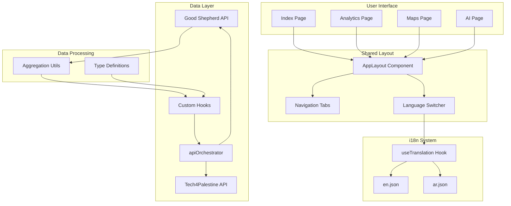
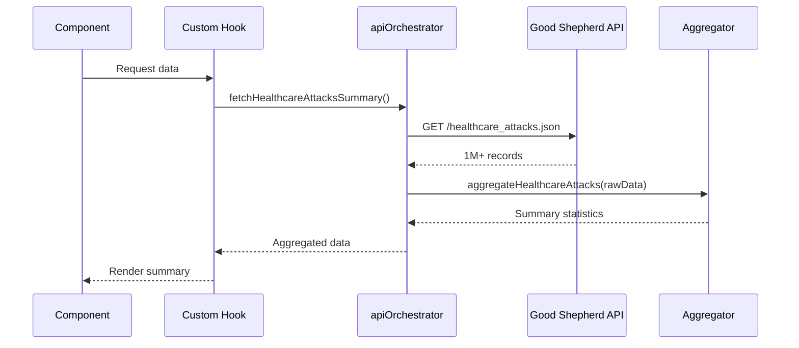
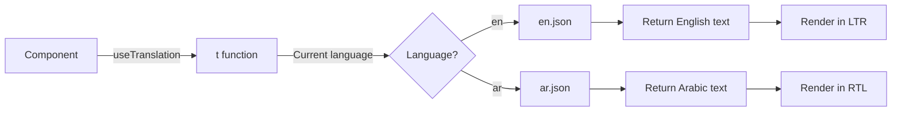

# Palestine Pulse Dashboard Improvement Plan

## Executive Summary

This document outlines the architectural plan to address three critical improvements to the Palestine Pulse Dashboard:

1. **Navigation Consistency**: Unify navigation across all pages using a shared layout
2. **Internationalization (i18n)**: Implement comprehensive translation system for Arabic support
3. **API Integration**: Integrate 6 new Good Shepherd Collective data sources

---

## Current State Analysis

### Problems Identified

#### 1. Navigation Inconsistency
- **Index.tsx**: Uses `AppLayout` with unified navigation tabs ✅
- **Analytics.tsx**: Custom header, no navigation tabs ❌
- **Maps.tsx**: Custom header, no navigation tabs ❌
- **Result**: Inconsistent user experience, broken navigation flow

#### 2. Incomplete Translation System
- **Current**: Only header elements translated
- **Problem**: 100+ hardcoded English strings in components
- **Impact**: Arabic language switch only affects 10% of UI
- **Missing**: Tab names, button labels, metrics, descriptions, time ranges

#### 3. Missing Data Sources
Six valuable API endpoints not integrated:
- `child_prisoners.json` - Historical child detention data
- `wb_data.json` - West Bank economic/demographic data  
- `healthcare_attacks.json` - Detailed healthcare attack records (1M+ records)
- `home_demolitions.json` - Home demolition database (large dataset)
- `ngo_data.json` - NGO operations and impact data
- `prisoner_data.json` - Comprehensive prisoner information

---

## Architecture Design

### Phase 1: Navigation Consistency Fix

#### Objective
Create uniform navigation experience across all pages using the existing `AppLayout` component.

#### Implementation Strategy

**1. Refactor Analytics.tsx**
```typescript
// BEFORE: Custom header with no navigation
<header className="border-b border-border...">
  <div className="container mx-auto px-6 py-4">
    // Custom header code
  </div>
</header>

// AFTER: Use AppLayout
<AppLayout showFilters={false} showExport={false}>
  <div className="container mx-auto px-4 py-8">
    // Content
  </div>
</AppLayout>
```

**2. Refactor Maps.tsx**
```typescript
// Same refactoring approach as Analytics.tsx
<AppLayout showFilters={false} showExport={false}>
  <main className="container mx-auto px-4 py-8">
    // Map content
  </main>
</AppLayout>
```

#### Benefits
- ✅ Consistent navigation tabs on all pages
- ✅ Active page highlighting works automatically
- ✅ Single source of truth for layout
- ✅ Easier maintenance

#### Files to Modify
- `src/pages/Analytics.tsx` - Remove custom header, wrap with AppLayout
- `src/pages/Maps.tsx` - Remove custom header, wrap with AppLayout

---

### Phase 2: Comprehensive i18n Implementation

#### Objective
Implement full translation support focusing on key user-facing elements.

#### Translation Coverage Strategy

**Priority 1: Navigation & Core UI** (Most visible)
- Navigation tabs (Dashboard, Analytics, Maps, AI)
- Main page headers and subtitles
- Action buttons (Export, Filter, Share)
- Theme toggle labels

**Priority 2: Data Labels & Metrics**
- Metric card titles (Total Killed, Injured, etc.)
- Tab names (Gaza, West Bank, Overview, etc.)
- Time range selectors (Last 7 Days, Last Month, etc.)
- Chart labels and legends

**Priority 3: Component Content**
- Section descriptions
- Helper text
- Error messages
- Loading states

#### i18n Structure

**en.json Structure:**
```json
{
  "app": {
    "title": "Palestine Humanitarian Dashboard",
    "subtitle": "Real-time humanitarian data visualization"
  },
  "nav": {
    "dashboard": "Dashboard",
    "analytics": "Analytics", 
    "maps": "Maps",
    "ai": "AI Analytics"
  },
  "tabs": {
    "gaza": "War on Gaza",
    "westBank": "West Bank",
    "overview": "Overview",
    "casualties": "Casualties Trend",
    "infrastructure": "Infrastructure",
    "press": "Press"
  },
  "timeRange": {
    "last7Days": "Last 7 Days",
    "lastMonth": "Last Month",
    "last60Days": "Last 60 Days",
    "last90Days": "Last 90 Days",
    "allTime": "All Time"
  },
  "metrics": {
    "totalKilled": "Total Killed",
    "totalInjured": "Total Injured",
    "children": "Children",
    "women": "Women",
    "massacres": "Massacres",
    "pressKilled": "Press Killed"
  },
  "analytics": {
    "economic": "Economic",
    "aid": "Aid",
    "healthcare": "Healthcare",
    "displacement": "Displacement",
    "education": "Education",
    "utilities": "Utilities",
    "food": "Food",
    "prisoners": "Prisoners",
    "settlements": "Settlements",
    "international": "International"
  },
  "actions": {
    "export": "Export",
    "filter": "Filter",
    "share": "Share",
    "viewDetails": "View Details"
  }
}
```

**ar.json Structure:** (Same keys, Arabic values)

#### RTL Support Strategy

**CSS Enhancements:**
```css
/* Add to index.css */
[dir="rtl"] {
  direction: rtl;
  text-align: right;
}

[dir="rtl"] .flex-row {
  flex-direction: row-reverse;
}

[dir="rtl"] .mr-2 {
  margin-right: 0;
  margin-left: 0.5rem;
}
```

#### Implementation Approach

**Component Updates Pattern:**
```typescript
// BEFORE
<h1>War on Gaza</h1>
<Button>Export Data</Button>

// AFTER  
const { t } = useTranslation();
<h1>{t('tabs.gaza')}</h1>
<Button>{t('actions.export')}</Button>
```

#### Files to Modify
- `src/i18n/locales/en.json` - Expand with all translations
- `src/i18n/locales/ar.json` - Add Arabic translations
- `src/pages/Index.tsx` - Update all hardcoded strings
- `src/pages/Analytics.tsx` - Update all hardcoded strings
- `src/pages/Maps.tsx` - Update all hardcoded strings
- `src/index.css` - Add RTL support styles

---

### Phase 3: API Integration Architecture

#### Objective
Integrate 6 new data sources with efficient data handling for large datasets.

#### Data Source Analysis

| Endpoint | Data Type | Size | Integration Strategy |
|----------|-----------|------|---------------------|
| `child_prisoners.json` | Time series by category | Medium | Direct integration |
| `wb_data.json` | Economic/demographic | Small | Direct integration |
| `healthcare_attacks.json` | Detailed records | Very Large (1M+) | **Aggregation required** |
| `home_demolitions.json` | Detailed records | Large | **Aggregation required** |
| `ngo_data.json` | Organization info | Medium | Direct integration |
| `prisoner_data.json` | Prisoner records | Medium | Direct integration |

#### Type Definitions

**New TypeScript Interfaces:**
```typescript
// src/types/goodshepherd.types.ts

export interface ChildPrisonerData {
  childPrisonersData: {
    "12 to 15 year olds": YearlyMonthlyData[];
    "Administrative detention": YearlyMonthlyData[];
    "Detention": YearlyMonthlyData[];
    "Female": YearlyMonthlyData[];
  };
}

export interface YearlyMonthlyData {
  year: string;
  months: {
    [month: string]: string | number;
  };
  timestamp: string;
}

export interface HealthcareAttackSummary {
  totalAttacks: number;
  byType: Record<string, number>;
  byGovernorate: Record<string, number>;
  byYear: Record<string, number>;
  trend: Array<{
    date: string;
    count: number;
  }>;
}

export interface HomeDemolitionSummary {
  totalDemolitions: number;
  byRegion: Record<string, number>;
  byYear: Record<string, number>;
  affectedPeople: number;
  trend: Array<{
    date: string;
    count: number;
  }>;
}

export interface WestBankData {
  economic: {
    gdp: number;
    unemployment: number;
    poverty: number;
  };
  demographic: {
    population: number;
    refugees: number;
  };
  // Additional fields based on actual API structure
}

export interface NGOData {
  organizations: Array<{
    name: string;
    sector: string;
    operations: string[];
    coverage: string[];
  }>;
}

export interface PrisonerData {
  prisoners: Array<{
    id: string;
    name?: string;
    age?: number;
    gender: string;
    detentionDate: string;
    charges?: string;
    status: string;
  }>;
  summary: {
    total: number;
    byStatus: Record<string, number>;
    byGender: Record<string, number>;
  };
}
```

#### Data Aggregation Utilities

**For Large Datasets:**
```typescript
// src/utils/dataAggregation.ts

export const aggregateHealthcareAttacks = (
  rawData: any[]
): HealthcareAttackSummary => {
  // Aggregate 1M+ records into summary statistics
  return {
    totalAttacks: rawData.length,
    byType: groupBy(rawData, 'type'),
    byGovernorate: groupBy(rawData, 'governorate'),
    byYear: groupBy(rawData, (item) => 
      new Date(item.date).getFullYear()
    ),
    trend: calculateTrend(rawData, 'monthly')
  };
};

export const aggregateHomeDemolitions = (
  rawData: any[]
): HomeDemolitionSummary => {
  // Aggregate large dataset
  return {
    totalDemolitions: rawData.length,
    byRegion: groupBy(rawData, 'region'),
    byYear: groupBy(rawData, (item) => 
      new Date(item.date).getFullYear()
    ),
    affectedPeople: sum(rawData, 'affectedPeople'),
    trend: calculateTrend(rawData, 'monthly')
  };
};
```

#### API Service Integration

**Update apiOrchestrator.ts:**
```typescript
// Add new endpoints
const GOOD_SHEPHERD_BASE = 'https://goodshepherdcollective.org/api';

export const ENDPOINTS = {
  // ... existing endpoints
  
  // Good Shepherd Collective endpoints
  childPrisoners: `${GOOD_SHEPHERD_BASE}/child_prisoners.json`,
  wbData: `${GOOD_SHEPHERD_BASE}/wb_data.json`,
  healthcareAttacks: `${GOOD_SHEPHERD_BASE}/healthcare_attacks.json`,
  homeDemolitions: `${GOOD_SHEPHERD_BASE}/home_demolitions.json`,
  ngoData: `${GOOD_SHEPHERD_BASE}/ngo_data.json`,
  prisonerData: `${GOOD_SHEPHERD_BASE}/prisoner_data.json`,
};

// Fetch functions with aggregation
export const fetchHealthcareAttacksSummary = async () => {
  const response = await fetch(ENDPOINTS.healthcareAttacks);
  const rawData = await response.json();
  return aggregateHealthcareAttacks(rawData);
};
```

#### Custom Hooks

**Create new data hooks:**
```typescript
// src/hooks/useGoodShepherdData.ts

export const useChildPrisoners = () => {
  return useQuery({
    queryKey: ['childPrisoners'],
    queryFn: () => fetch(ENDPOINTS.childPrisoners)
      .then(res => res.json()),
    staleTime: 1000 * 60 * 60, // 1 hour
  });
};

export const useHealthcareAttacksSummary = () => {
  return useQuery({
    queryKey: ['healthcareAttacksSummary'],
    queryFn: fetchHealthcareAttacksSummary,
    staleTime: 1000 * 60 * 60,
  });
};

export const useHomeDemolitionsSummary = () => {
  return useQuery({
    queryKey: ['homeDemolitionsSummary'],
    queryFn: fetchHomeDemolitionsSummary,
    staleTime: 1000 * 60 * 60,
  });
};

export const useWestBankData = () => {
  return useQuery({
    queryKey: ['wbData'],
    queryFn: () => fetch(ENDPOINTS.wbData)
      .then(res => res.json()),
    staleTime: 1000 * 60 * 60,
  });
};

export const useNGOData = () => {
  return useQuery({
    queryKey: ['ngoData'],
    queryFn: () => fetch(ENDPOINTS.ngoData)
      .then(res => res.json()),
    staleTime: 1000 * 60 * 60,
  });
};

export const usePrisonerData = () => {
  return useQuery({
    queryKey: ['prisonerData'],
    queryFn: () => fetch(ENDPOINTS.prisonerData)
      .then(res => res.json()),
    staleTime: 1000 * 60 * 60,
  });
};
```

#### Integration Points

**1. Child Prisoners → PrisonersStats Component**
```typescript
// Update src/components/dashboards/PrisonersStats.tsx
const { data: childPrisonerData } = useChildPrisoners();

// Add new charts for:
// - Child prisoners by age group (12-15)
// - Administrative detention trends
// - Female prisoners trends
```

**2. Healthcare Attacks → HealthcareStatus Component**
```typescript
// Update src/components/dashboards/HealthcareStatus.tsx
const { data: attacksSummary } = useHealthcareAttacksSummary();

// Add new metrics:
// - Total healthcare attacks
// - Attacks by type (hospital, clinic, ambulance)
// - Geographic distribution
// - Monthly trend chart
```

**3. Home Demolitions → WestBankOverview Component**
```typescript
// Update src/components/dashboard/WestBankOverview.tsx
const { data: demolitions } = useHomeDemolitionsSummary();

// Add new section:
// - Total demolitions
// - Affected people count
// - Regional breakdown
// - Yearly trend
```

**4. West Bank Data → Analytics Page**
```typescript
// Update Economic Impact and relevant components
const { data: wbData } = useWestBankData();

// Enhance with:
// - GDP impact visualization
// - Unemployment trends
// - Poverty statistics
```

**5. NGO Data → New Component**
```typescript
// Create src/components/dashboards/NGOOperations.tsx
const { data: ngoData } = useNGOData();

// Visualize:
// - NGO presence by sector
// - Geographic coverage map
// - Operational capacity
```

**6. Prisoner Data → PrisonersStats Enhancement**
```typescript
// Enhance existing prisoners component
const { data: prisonerData } = usePrisonerData();

// Add detailed views:
// - Prisoner demographics
// - Detention status breakdown
// - Time in detention statistics
```

---

## Implementation Workflow

### Step-by-Step Execution

#### Phase 1: Navigation (Estimated: 2-3 hours)
1. ✅ Refactor Analytics.tsx to use AppLayout
2. ✅ Refactor Maps.tsx to use AppLayout  
3. ✅ Remove duplicate header code
4. ✅ Test navigation across all pages
5. ✅ Verify active highlighting works

#### Phase 2: i18n (Estimated: 4-6 hours)
1. ✅ Expand en.json with ~100 new translation keys
2. ✅ Create corresponding ar.json translations
3. ✅ Add RTL CSS support to index.css
4. ✅ Update Index.tsx components
5. ✅ Update Analytics.tsx components
6. ✅ Update Maps.tsx components
7. ✅ Test language switching comprehensively

#### Phase 3: API Integration (Estimated: 6-8 hours)
1. ✅ Create TypeScript type definitions
2. ✅ Create data aggregation utilities
3. ✅ Add endpoints to apiOrchestrator.ts
4. ✅ Create custom hooks for each data source
5. ✅ Integrate child_prisoners into PrisonersStats
6. ✅ Add healthcare_attacks to HealthcareStatus
7. ✅ Add home_demolitions to WestBankOverview
8. ✅ Integrate wb_data into Analytics
9. ✅ Create NGOOperations component
10. ✅ Enhance prisoner visualizations
11. ✅ Test all integrations

**Total Estimated Time: 12-17 hours**

---

## Testing Strategy

### Navigation Testing
- [ ] Verify tabs appear on all pages
- [ ] Test active page highlighting
- [ ] Check responsive behavior
- [ ] Verify smooth transitions

### i18n Testing
- [ ] Switch to Arabic, verify all text changes
- [ ] Check RTL layout rendering
- [ ] Test with long Arabic text
- [ ] Verify date/number formatting
- [ ] Check all components for untranslated text

### API Integration Testing
- [ ] Verify all endpoints fetch successfully
- [ ] Check data aggregation accuracy
- [ ] Test error handling for failed requests
- [ ] Verify loading states display correctly
- [ ] Check chart rendering with new data
- [ ] Test with different date ranges
- [ ] Verify data refresh behavior

---

## Risk Mitigation

### Potential Issues

**1. Large Dataset Performance**
- **Risk**: Healthcare attacks (1M+ records) may slow browser
- **Mitigation**: Aggressive aggregation on fetch, not in browser
- **Fallback**: Implement virtual scrolling if detailed view needed

**2. API Reliability**
- **Risk**: Good Shepherd endpoints may be slow/unavailable
- **Mitigation**: Implement proper error boundaries and loading states
- **Fallback**: Cache data locally, show last successful fetch

**3. Translation Quality**
- **Risk**: Google Translate quality for Arabic may be poor
- **Mitigation**: Focus on common terms, use native speaker review if possible
- **Note**: Can iterate on translations post-deployment

**4. Breaking Changes**
- **Risk**: Refactoring may break existing functionality
- **Mitigation**: Test thoroughly before proceeding to next phase
- **Recovery**: Git rollback points between phases

---

## Success Criteria

### Phase 1: Navigation
✅ All pages use AppLayout  
✅ Navigation tabs visible on every page  
✅ Active page highlighting works  
✅ No duplicate header code

### Phase 2: i18n
✅ 80%+ of visible UI text is translated  
✅ Arabic language switch affects entire app  
✅ RTL layout renders correctly  
✅ No layout breaking with Arabic text

### Phase 3: API Integration
✅ All 6 endpoints successfully integrated  
✅ Large datasets aggregated efficiently  
✅ New visualizations render without errors  
✅ Data refresh works as expected  
✅ No performance degradation

---

## Files to Create/Modify

### New Files
- `src/types/goodshepherd.types.ts`
- `src/utils/dataAggregation.ts`
- `src/hooks/useGoodShepherdData.ts`
- `src/components/dashboards/NGOOperations.tsx`
- `DASHBOARD_IMPROVEMENT_PLAN.md` (this file)

### Modified Files
- `src/pages/Analytics.tsx`
- `src/pages/Maps.tsx`
- `src/pages/Index.tsx`
- `src/i18n/locales/en.json`
- `src/i18n/locales/ar.json`
- `src/index.css`
- `src/services/apiOrchestrator.ts`
- `src/components/dashboards/PrisonersStats.tsx`
- `src/components/dashboards/HealthcareStatus.tsx`
- `src/components/dashboard/WestBankOverview.tsx`

---

## Next Steps

Once this plan is approved, proceed with implementation in Code mode:

1. **Start with Phase 1** (Navigation) - Quick wins, builds confidence
2. **Move to Phase 2** (i18n) - High visibility improvement
3. **Complete Phase 3** (API Integration) - Most complex, highest value

Each phase can be tested independently before moving to the next.

---

## Mermaid Diagrams

### System Architecture



### Data Flow for Large Datasets



### Translation Workflow



---

## Conclusion

This plan provides a comprehensive roadmap to transform the Palestine Pulse Dashboard into a fully internationalized, consistently navigable application enriched with valuable additional data sources. The phased approach ensures manageable implementation with clear success criteria at each stage.

Ready to proceed with Code mode implementation!