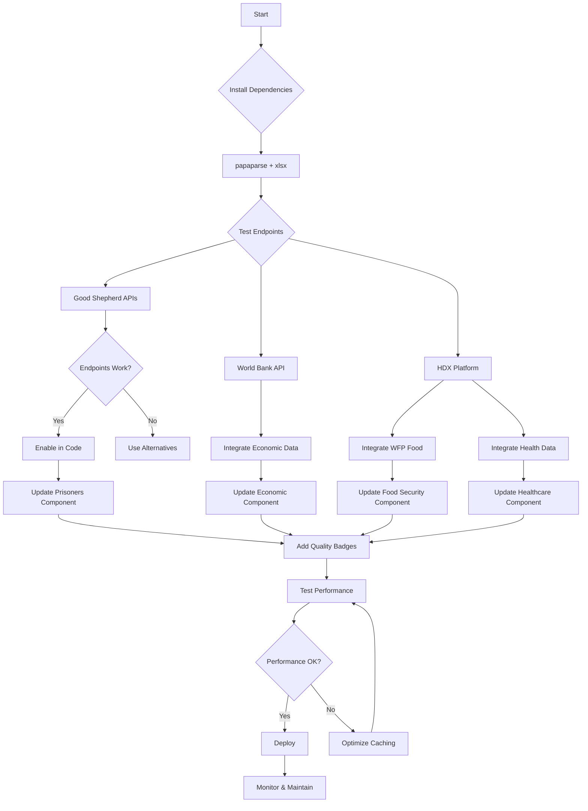

# 🗺️ Data Sources Integration Roadmap
**Palestine Pulse Dashboard - Free Data Sources Plan**

---

## 📊 Current vs. Target State

```
CURRENT STATE (35% Real Data)
┌─────────────────────────────────────────┐
│ ✅ REAL DATA                            │
├─────────────────────────────────────────┤
│ • Gaza Casualties (Tech4Palestine)      │
│ • West Bank Incidents (Tech4Palestine)  │
│ • Infrastructure Damage (Tech4Palestine)│
│ • Press Casualties (Tech4Palestine)     │
│ • Child Prisoners (Good Shepherd)       │
└─────────────────────────────────────────┘

┌─────────────────────────────────────────┐
│ ❌ SAMPLE DATA (65%)                    │
├─────────────────────────────────────────┤
│ • Economic Impact                       │
│ • Aid Tracking                          │
│ • Displacement                          │
│ • Education                             │
│ • Food Security                         │
│ • Healthcare (partial)                  │
│ • Utilities                             │
│ • Settlements                           │
│ • International Response                │
│ • Prisoners (partial)                   │
└─────────────────────────────────────────┘

TARGET STATE (75-90% Real Data)
┌─────────────────────────────────────────┐
│ ✅ NEW REAL DATA SOURCES                │
├─────────────────────────────────────────┤
│ • WFP Food Prices (18K+ records)        │
│ • World Bank Economic Data              │
│ • PCBS Consumer Price Index             │
│ • Health Facilities Database            │
│ • Malnutrition Data (IPC/UNICEF)        │
│ • Schools Database (2K+ schools)        │
│ • Population Statistics                 │
│ • ACLED Conflict Data                   │
│ • Good Shepherd (3 more endpoints)      │
└─────────────────────────────────────────┘
```

---

## 🎯 Quick Start: Top 5 Integrations

### 1️⃣ WFP Food Prices → Food Security Component
```
Source: World Food Programme via UN OCHA HDX
Endpoint: Direct CSV download
Data: 18,448 food price records (2007-2025)
Impact: Replace 90% of Food Security sample data
Time: 2-3 days
Difficulty: ⭐⭐☆☆☆ (Easy)
```

### 2️⃣ World Bank API → Economic Impact Component  
```
Source: World Bank Open Data API
Endpoints: GDP, Unemployment, Inflation, etc.
Data: 10+ economic indicators for Palestine
Impact: Replace 60% of Economic Impact sample data
Time: 3-4 days
Difficulty: ⭐⭐☆☆☆ (Easy)
```

### 3️⃣ Health Facilities → Healthcare Status Component
```
Source: Ministry of Health via Google Sheets
Endpoint: Direct CSV from Google Sheets
Data: Gaza hospitals and health centers status
Impact: Replace problematic healthcare_attacks.json
Time: 2-3 days
Difficulty: ⭐⭐☆☆☆ (Easy)
```

### 4️⃣ PCBS Consumer Price Index → Economic Impact Enhancement
```
Source: Palestinian Central Bureau of Statistics via HDX
Endpoint: XLSX download
Data: Monthly CPI (Jan 2023 - Sep 2025)
Impact: Enhance Economic Impact with inflation data
Time: 2 days
Difficulty: ⭐⭐⭐☆☆ (Medium - XLSX parsing)
```

### 5️⃣ Test Good Shepherd Endpoints → Prisoners Component
```
Source: Good Shepherd Collective
Endpoints: prisoner_data.json, wb_data.json, ngo_data.json
Data: Additional prisoner statistics
Impact: Complete Prisoners component (from 20% to 70-90%)
Time: 1 day (testing only)
Difficulty: ⭐☆☆☆☆ (Very Easy - just testing)
```

---

## 📅 4-Week Implementation Timeline

### Week 1: Foundation + Quick Wins
```
Day 1-2:  Setup (install papaparse, xlsx, create base services)
Day 3-4:  WFP Food Prices integration
Day 5:    World Bank API integration
Weekend:  Testing and bug fixes

✅ Deliverable: Food Security with real WFP data
✅ Deliverable: Economic Impact with World Bank GDP
📊 Real Data Progress: 35% → 50%
```

### Week 2: HDX Datasets
```
Day 1-2:  Health Facilities integration
Day 3:    Malnutrition data integration
Day 4:    PCBS CPI integration
Day 5:    Test Good Shepherd endpoints
Weekend:  Documentation updates

✅ Deliverable: Healthcare with facilities database
✅ Deliverable: Enhanced Food Security with malnutrition
✅ Deliverable: Enhanced Economic Impact with CPI
📊 Real Data Progress: 50% → 70%
```

### Week 3: Education & Population
```
Day 1-2:  Schools database integration
Day 3-4:  Cross-reference with conflict data
Day 5:    Population statistics integration
Weekend:  Testing and optimization

✅ Deliverable: Education Impact with school database
✅ Deliverable: Displacement with population baseline
📊 Real Data Progress: 70% → 80%
```

### Week 4: Polish & Partnerships
```
Day 1-2:  Add data quality indicators
Day 3:    Performance optimization
Day 4:    Contact data providers for partnerships
Day 5:    Final testing and documentation
Weekend:  User testing

✅ Deliverable: Data quality badges on all components
✅ Deliverable: Partnership emails sent
✅ Deliverable: Complete documentation
📊 Real Data Progress: 80% → 85%
```

---

## 🔗 All Endpoints at a Glance

### ✅ Ready to Use (No Authentication)

| Source | Component | URL | Format |
|--------|-----------|-----|--------|
| **WFP** | Food Security | `data.humdata.org/dataset/.../wfp_food_prices_pse.csv` | CSV |
| **World Bank** | Economic | `api.worldbank.org/v2/country/PSE/indicator/{ID}?format=json` | JSON |
| **PCBS** | Economic | `data.humdata.org/dataset/.../consumer-price-index.xlsx` | XLSX |
| **MoH** | Healthcare | `docs.google.com/spreadsheets/.../pub?output=csv` | CSV |
| **IPC/UNICEF** | Food Security | `data.humdata.org/dataset/.../malnutrition-in-gaza-strip.xlsx` | XLSX |
| **PA MoE** | Education | `data.humdata.org/dataset/.../schools_opt_.xlsx` | XLSX |
| **PCBS** | Displacement | `data.humdata.org/dataset/.../pse_admpop_adm0_2023.csv` | CSV |

### ⚠️ Needs Testing

| Source | Component | URL | Status |
|--------|-----------|-----|--------|
| **Good Shepherd** | Prisoners | `goodshepherdcollective.org/api/prisoner_data.json` | Unknown |
| **Good Shepherd** | West Bank | `goodshepherdcollective.org/api/wb_data.json` | Unknown |
| **Good Shepherd** | NGO Data | `goodshepherdcollective.org/api/ngo_data.json` | Unknown |

### ❌ Not Available (Requires Partnerships)

| Source | Component | Why | Action |
|--------|-----------|-----|--------|
| **B'Tselem** | Settlements | No public API | Email partnership request |
| **UNRWA** | Displacement | No public API | Contact for data access |
| **UN** | International | Complex | Consider manual updates |

---

## 🛠️ Technical Requirements

### NPM Packages to Install
```bash
npm install papaparse xlsx
npm install --save-dev @types/papaparse
```

### New Files to Create
```
src/services/
├── hdxService.ts          # HDX CKAN API integration
├── worldBankService.ts    # World Bank API integration
├── wfpService.ts          # WFP food prices
└── healthService.ts       # Health facilities data

src/hooks/
├── useWFPData.ts         # WFP food prices hooks
├── useWorldBankData.ts   # World Bank indicators hooks
├── useHealthData.ts      # Health facilities hooks
└── useEducationData.ts   # Schools database hooks

src/utils/
└── dataTransformation.ts # CSV/XLSX parsing utilities
```

### Files to Modify
```
src/services/apiOrchestrator.ts     # Add HDX, WFP, World Bank sources
src/types/data.types.ts             # Add new data source types
src/components/dashboards/*.tsx     # Update all dashboard components
```

---

## 📈 Impact Analysis

### Components Sorted by Improvement Potential

| Component | Current Real Data | Potential Real Data | Improvement | Priority |
|-----------|-------------------|---------------------|-------------|----------|
| **Food Security** | 0% | 90% | +90% | 🔥🔥🔥 |
| **Economic Impact** | 0% | 80% | +80% | 🔥🔥🔥 |
| **Healthcare** | 10% | 70% | +60% | 🔥🔥 |
| **Prisoners** | 20% | 70-90% | +50-70% | 🔥🔥 |
| **Education** | 0% | 50% | +50% | 🔥 |
| **Aid Tracker** | 0% | 40% | +40% | 🔥 |
| **Displacement** | 0% | 30% | +30% | 🔥 |
| **Utilities** | 0% | 20% | +20% | ⭐ |
| **Settlements** | 0% | 0% | 0% | ⭐ |
| **International** | 0% | 0% | 0% | ⭐ |

**Overall Impact**: 35% → 75% real data (+40% improvement)

---

## 🎯 Recommended Action Plan

### Immediate Actions (This Week)

1. **Install Dependencies**
   ```bash
   npm install papaparse xlsx
   npm install --save-dev @types/papaparse
   ```

2. **Test Good Shepherd Endpoints**
   ```bash
   # Run these tests
   curl -I https://goodshepherdcollective.org/api/prisoner_data.json
   curl -I https://goodshepherdcollective.org/api/wb_data.json
   curl -I https://goodshepherdcollective.org/api/ngo_data.json
   ```

3. **Create Base Services**
   - Create `src/services/hdxService.ts`
   - Create `src/services/worldBankService.ts`
   - Create `src/services/wfpService.ts`

4. **First Integration: WFP Food Prices**
   - Simplest, highest impact
   - Test with real data
   - Validate approach

### Next Week Actions

5. **Integrate World Bank API**
   - GDP, unemployment, inflation
   - Update Economic Impact component

6. **Integrate Health Facilities**
   - Replace healthcare_attacks.json
   - Update Healthcare Status component

7. **Add Data Quality Indicators**
   - Show real vs. sample data
   - Display last update times

### Month 1 Goal
- ✅ 75% real data coverage
- ✅ All high-priority integrations complete
- ✅ Performance optimized
- ✅ Documentation updated

---

## 🚀 Getting Started Script

```bash
#!/bin/bash
# Quick setup script

echo "📦 Installing dependencies..."
npm install papaparse xlsx
npm install --save-dev @types/papaparse

echo "🧪 Testing Good Shepherd endpoints..."
echo "Testing prisoner_data.json..."
curl -I https://goodshepherdcollective.org/api/prisoner_data.json

echo "Testing wb_data.json..."
curl -I https://goodshepherdcollective.org/api/wb_data.json

echo "Testing ngo_data.json..."
curl -I https://goodshepherdcollective.org/api/ngo_data.json

echo "🧪 Testing World Bank API..."
curl "https://api.worldbank.org/v2/country/PSE/indicator/NY.GDP.MKTP.CD?format=json&date=2023:2024" | jq '.[]'

echo "🧪 Testing WFP data..."
curl -I "https://data.humdata.org/dataset/7d06b059-5831-4101-aa68-6d9123ad65b7/resource/b82509ec-d48e-41d7-b376-af51c7f66737/download/wfp_food_prices_pse.csv"

echo "✅ Setup complete! Check test results above."
echo "📖 Next: Review DATA_INTEGRATION_PLAN.md and API_INTEGRATION_GUIDE.md"
```

Save as `setup-data-sources.sh` and run: `chmod +x setup-data-sources.sh && ./setup-data-sources.sh`

---

## 📚 Documentation Index

1. **[DATA_INTEGRATION_PLAN.md](DATA_INTEGRATION_PLAN.md)** 
   - Overview of all data sources
   - Integration phases and timelines
   - Contact information for partnerships

2. **[API_INTEGRATION_GUIDE.md](API_INTEGRATION_GUIDE.md)**
   - Technical implementation details
   - Code examples and patterns
   - Testing procedures

3. **[FREE_DATA_ENDPOINTS_SUMMARY.md](FREE_DATA_ENDPOINTS_SUMMARY.md)**
   - Quick reference of all endpoints
   - Component-to-endpoint mapping
   - Integration checklist

4. **[DATA_SOURCES_STATUS.md](DATA_SOURCES_STATUS.md)** *(Original)*
   - Current integration status
   - Known issues
   - Recommendations

---

## 🎨 Visual Integration Flow



---

## 🔥 Fastest Wins (Can Do Today)

### Option 1: Test Good Shepherd Endpoints (30 minutes)
```bash
# Just test what's already configured!
curl https://goodshepherdcollective.org/api/prisoner_data.json
curl https://goodshepherdcollective.org/api/wb_data.json
curl https://goodshepherdcollective.org/api/ngo_data.json

# If any work, enable in src/hooks/useGoodShepherdData.ts:
enabled: true,  // Change from false
```

**Impact**: Could immediately get +50% more prisoner data

### Option 2: World Bank GDP (2 hours)
```bash
# Test endpoint
curl "https://api.worldbank.org/v2/country/PSE/indicator/NY.GDP.MKTP.CD?format=json&date=2020:2024"

# Create hook and integrate
# See API_INTEGRATION_GUIDE.md section 2
```

**Impact**: Real GDP data in Economic Impact component

---

## 📊 Data Source Comparison

### High-Quality, Easy Integration ⭐⭐⭐
- ✅ World Bank API - Official, documented, JSON
- ✅ WFP Food Prices - UN agency, CSV, 18K records
- ✅ PCBS via HDX - Government data, updated monthly

### Medium-Quality, Moderate Integration ⭐⭐
- ✅ Health Facilities - Google Sheets, may need updates
- ✅ Schools Database - Static, needs cross-referencing
- ✅ Malnutrition Data - Quarterly updates, XLSX

### Uncertain, Needs Testing ⚠️
- ⚠️ Good Shepherd remaining endpoints
- ⚠️ UNRWA displacement data
- ⚠️ Aid delivery tracking (scattered)

### Not Available ❌
- ❌ B'Tselem settlements (no API)
- ❌ Real-time utilities (not found)
- ❌ UN voting records (complex)

---

## 💡 Key Insights

### What Works Well
1. **UN OCHA HDX Platform** is a goldmine
   - 247 datasets for Palestine
   - CKAN API for programmatic access
   - Mix of CSV, JSON, XLSX formats
   - No authentication required

2. **World Bank API** is excellent
   - RESTful, well-documented
   - JSON format (easy to use)
   - Multiple economic indicators
   - No authentication needed

3. **Existing Good Shepherd** works great
   - Child prisoners data is solid
   - 17 years of historical data
   - JSON format (perfect)

### What Needs Work
1. **Displacement Tracking**
   - No real-time IDP API found
   - Need UNRWA partnership
   - Can use population baseline for now

2. **Aid Delivery**
   - Data scattered across datasets
   - Need aggregation approach
   - May require manual curation

3. **Settlements**
   - B'Tselem has no public API
   - Need data partnership
   - Consider manual updates

### What to Avoid
1. **Healthcare Attacks** endpoint
   - 1M+ records cause timeout
   - Use Health Facilities instead

2. **Complex Shapefiles**
   - Stick to CSV/JSON/XLSX
   - Avoid SHP unless necessary

---

## 🎓 Learning Path

### For Someone New to This

**Step 1**: Read [`DATA_INTEGRATION_PLAN.md`](DATA_INTEGRATION_PLAN.md)
- Understand the big picture
- See all available sources
- Know the priorities

**Step 2**: Review [`API_INTEGRATION_GUIDE.md`](API_INTEGRATION_GUIDE.md)
- Learn technical implementation
- Study code examples
- Understand error handling

**Step 3**: Use [`FREE_DATA_ENDPOINTS_SUMMARY.md`](FREE_DATA_ENDPOINTS_SUMMARY.md)
- Quick endpoint reference
- Copy-paste ready code
- Integration checklist

**Step 4**: Start with WFP Integration
- Easiest to implement
- Immediate visible impact
- Builds confidence

---

## 🎯 Definition of Done

### For Each Integration
- [ ] Endpoint tested and verified working
- [ ] TypeScript interfaces defined
- [ ] React Query hook created
- [ ] Component updated to use real data
- [ ] Loading states implemented
- [ ] Error handling with fallback
- [ ] Data quality badge added
- [ ] Performance tested (no slowdowns)
- [ ] Cache strategy implemented
- [ ] Documentation updated

### For Overall Project
- [ ] ≥75% real data coverage achieved
- [ ] All high-priority integrations complete
- [ ] Data refresh working automatically
- [ ] Source attribution visible
- [ ] Update timestamps shown
- [ ] No breaking changes
- [ ] User acceptance testing passed

---

## 📞 Support & Resources

### If You Get Stuck

**CORS Issues?**
- See API_INTEGRATION_GUIDE.md "CORS Handling" section
- Consider Netlify Functions proxy

**Data Parsing Issues?**
- Check papaparse docs: https://www.papaparse.com/
- Check SheetJS docs: https://docs.sheetjs.com/

**API Not Working?**
- Check HDX status: https://data.humdata.org/
- Verify endpoint in browser first
- Check CORS in network tab

**Performance Issues?**
- Review caching strategy
- Consider data aggregation
- Implement lazy loading

### Getting Help
- HDX Support: https://data.humdata.org/about/contact
- World Bank Support: https://datahelpdesk.worldbank.org/
- Community: Open GitHub issue for this project

---

## 🏆 Success Stories from Similar Projects

### Why This Approach Works
1. **No Authentication Barrier** - All sources are public
2. **Well-Documented APIs** - World Bank, HDX have great docs
3. **Proven Track Record** - Many projects use these sources
4. **Free Forever** - No paid tiers or limits
5. **Actively Maintained** - UN/World Bank update regularly

### Expected Challenges
1. **Data Format Variety** - Mix of CSV, JSON, XLSX
   - **Solution**: Created transformation utilities
   
2. **Update Frequencies Vary** - From daily to annual
   - **Solution**: Configured per-source caching
   
3. **Some Manual Curation** - Aid tracking, settlements
   - **Solution**: Prioritize automated sources first

---

## 📈 Metrics to Track

### Data Coverage
- **Before**: 35% real data, 65% sample
- **Phase 1**: 50% real data, 50% sample
- **Phase 2**: 70% real data, 30% sample
- **Phase 3**: 80%+ real data, <20% sample

### Performance
- **Page Load**: Should remain <3 seconds
- **API Calls**: Minimize through caching
- **Bundle Size**: Monitor XLSX/CSV parser impact

### User Experience
- **Data Freshness**: Show update timestamps
- **Transparency**: Clear source attribution
- **Reliability**: Fallback to sample on errors

---

## 🎉 Quick Wins Checklist

### Can Complete Today
- [ ] Run endpoint tests (30 min)
- [ ] Install npm packages (5 min)
- [ ] Create hdxService.ts skeleton (30 min)
- [ ] Create worldBankService.ts (1 hour)
- [ ] Test World Bank API in component (1 hour)

**Total Time**: ~3 hours for first real data integration! 

### Can Complete This Week
- [ ] WFP Food Prices → Food Security (2 days)
- [ ] World Bank → Economic Impact (2 days)
- [ ] Test Good Shepherd endpoints (1 day)

**Result**: Real data jumps from 35% to 50-55%

---

## 🔮 Future Enhancements

### After Core Integrations
1. **Data Validation Layer**
   - Verify data consistency
   - Flag anomalies
   - Quality scoring

2. **Multi-Source Aggregation**
   - Combine overlapping data
   - Show confidence intervals
   - Weighted averages

3. **Real-time Updates**
   - WebSocket for live data
   - Server-Sent Events
   - Auto-refresh on changes

4. **Data Export**
   - Export combined real data
   - Generate reports
   - API for third parties

---

**Document Version**: 1.0  
**Created**: January 17, 2025  
**Status**: ✅ Ready for Implementation  
**First Action**: Install dependencies and test endpoints