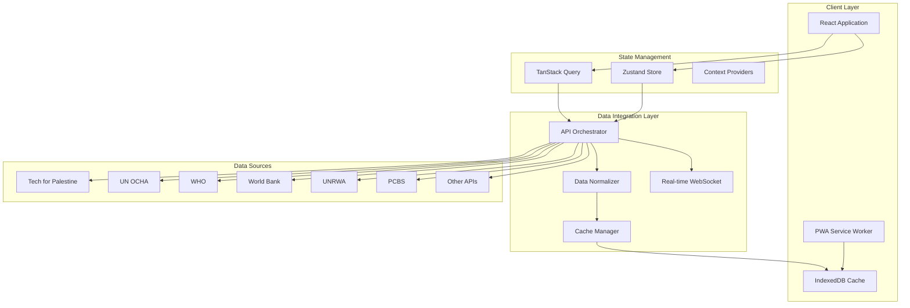
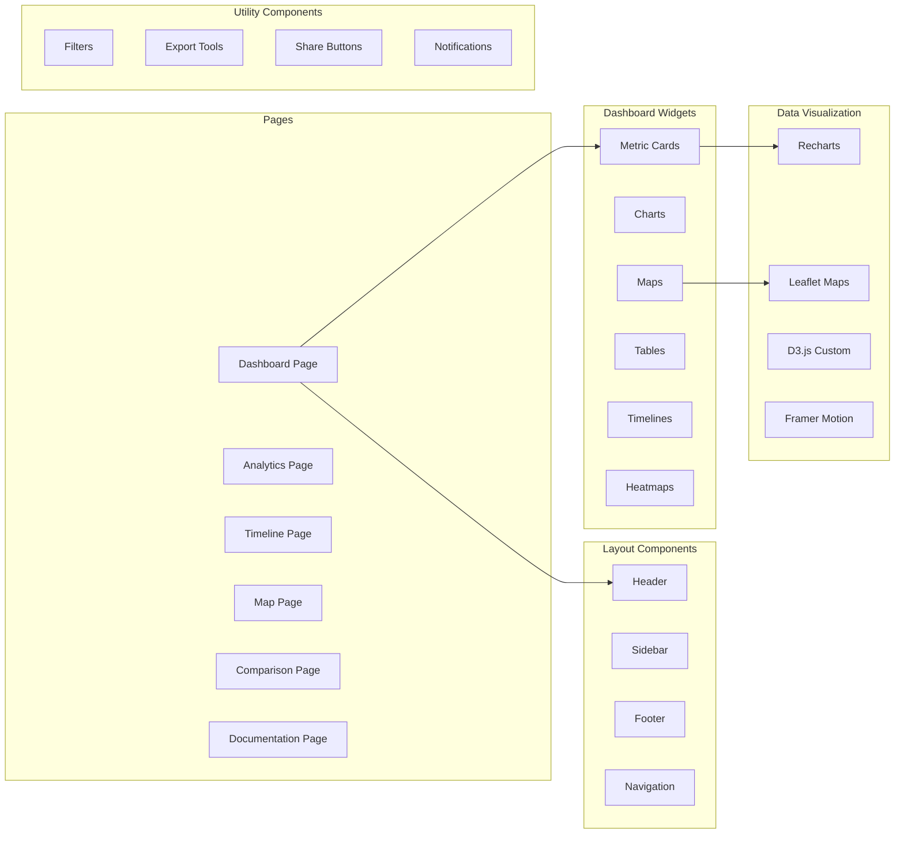
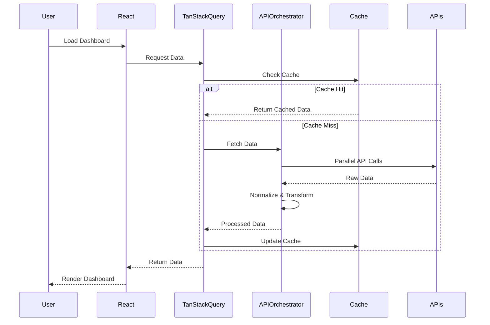

# Palestine Humanitarian Dashboard V2 - Comprehensive Upgrade Plan

## Executive Summary

This document outlines a complete upgrade strategy to transform the Palestine Humanitarian Dashboard into a comprehensive, multi-source data platform with advanced analytics, interactive visualizations, and enhanced user experience.

---

## Table of Contents

1. [Current State Analysis](#current-state-analysis)
2. [V2 Vision and Goals](#v2-vision-and-goals)
3. [Data Sources Integration](#data-sources-integration)
4. [Architecture Overview](#architecture-overview)
5. [New Features and Components](#new-features-and-components)
6. [Implementation Phases](#implementation-phases)
7. [Technical Stack Enhancements](#technical-stack-enhancements)
8. [Performance and Optimization](#performance-and-optimization)

---

## Current State Analysis

### Existing Features
- ✅ Gaza casualties overview with demographic breakdowns
- ✅ West Bank casualties tracking
- ✅ Press killed statistics and detailed list
- ✅ Infrastructure damage tracking (residential, mosques, schools, hospitals)
- ✅ Daily casualty trends with area charts
- ✅ Demographic distribution visualizations (pie charts, bar charts)
- ✅ Theme toggle (dark/light mode)
- ✅ Date range filtering (7-365 days)
- ✅ Responsive design with Tailwind CSS
- ✅ Tech for Palestine API integration

### Current Data Sources
- Tech for Palestine API v2/v3:
  - `/killed-in-gaza.min.json`
  - `/press_killed_in_gaza.json`
  - `/summary.json`
  - `/casualties_daily.json`
  - `/west_bank_daily.json`
  - `/infrastructure-damaged.json`

### Limitations to Address
- Single data source dependency
- Limited interactive features
- No geographic visualization
- No historical context or timeline
- Limited comparative analysis
- No data export capabilities
- No real-time updates
- English-only interface
- No predictive analytics
- Limited filtering options

---

## V2 Vision and Goals

### Primary Objectives

1. **Comprehensive Data Integration**: Aggregate data from multiple authoritative sources
2. **Enhanced Visualization**: Interactive maps, timelines, and advanced charts
3. **Deep Analytics**: Predictive modeling, correlation analysis, anomaly detection
4. **User Experience**: Customizable dashboards, multi-language, accessibility
5. **Real-time Updates**: Live data streaming and notifications
6. **Export & Share**: Data download and sharing capabilities
7. **Mobile-First**: Progressive Web App with offline support

### Key Metrics for Success

- Support 10+ data sources
- 50+ interactive widgets/components
- <2s page load time
- 95+ Lighthouse accessibility score
- Support 5+ languages
- 100% test coverage for critical paths

---

## Data Sources Integration

### Primary Data Sources

#### 1. Tech for Palestine API (Existing + New Endpoints)
```
Base URL: https://data.techforpalestine.org/api/
```

**Existing Endpoints:**
- ✅ v3/killed-in-gaza.min.json
- ✅ v2/press_killed_in_gaza.json
- ✅ v3/summary.json
- ✅ v2/casualties_daily.json
- ✅ v2/west_bank_daily.json
- ✅ v3/infrastructure-damaged.json

**New Endpoints to Explore:**
- Prisoners and detainees data
- Settlement expansion data
- Humanitarian aid deliveries
- Medical facilities status
- Water and utilities infrastructure
- Economic indicators

#### 2. UN OCHA (Office for the Coordination of Humanitarian Affairs)
```
Humanitarian Data Exchange API
Base URL: https://data.humdata.org/api/
```

**Data Points:**
- Humanitarian access restrictions
- Aid delivery statistics
- Food security assessments
- Shelter and protection needs
- Population displacement figures
- Conflict incidents mapping

#### 3. WHO (World Health Organization)
```
Health Data API
```

**Data Points:**
- Health facility functionality status
- Disease outbreak tracking
- Medical supply availability
- Vaccination coverage rates
- Maternal and child health indicators
- Mental health service access

#### 4. World Bank Open Data
```
Base URL: https://api.worldbank.org/v2/
```

**Data Points:**
- GDP and economic growth indicators
- Unemployment rates
- Poverty and inequality metrics
- Trade statistics
- Education enrollment rates
- Infrastructure development indices

#### 5. UNRWA (UN Relief and Works Agency)
```
Refugee and Displacement Data
```

**Data Points:**
- Registered refugee statistics
- Camp population figures
- Education program metrics
- Healthcare service delivery
- Employment and livelihood programs
- Emergency assistance distribution

#### 6. PCBS (Palestinian Central Bureau of Statistics)
```
National Statistics
```

**Data Points:**
- Demographic statistics
- Economic indicators
- Labor force surveys
- Cost of living indices
- Agricultural production
- Industrial activity

#### 7. B'Tselem (Israeli Information Center for Human Rights)
```
Human Rights Documentation
```

**Data Points:**
- Settler violence incidents
- House demolitions
- Land confiscation records
- Checkpoint and closure data
- Administrative detention statistics
- Movement restrictions

#### 8. Social Media and News APIs (Optional)

**For Sentiment and Coverage Analysis:**
- Twitter API for trending topics
- News API for media coverage
- Reddit API for community discussions

---

## Architecture Overview

### System Architecture Diagram



### Component Architecture



### Data Flow Architecture



---

## New Features and Components

### 1. Interactive Map Visualization

**Component: `InteractiveMap.tsx`**

**Features:**
- Geographic casualty heatmap for Gaza and West Bank
- Infrastructure damage markers (color-coded by severity)
- Settlement expansion overlay for West Bank
- Checkpoint and closure locations
- Click-through to detailed location information
- Animation showing progression over time
- Toggle layers (casualties, infrastructure, settlements, etc.)

**Technology Stack:**
- Leaflet or Mapbox GL JS for mapping
- GeoJSON for geographic data
- Custom tile layers for heat mapping

**Data Requirements:**
- Latitude/longitude coordinates for incidents
- Administrative boundary data
- Settlement locations and expansion data
- Infrastructure coordinates

---

### 2. Historical Timeline Component

**Component: `EventTimeline.tsx`**

**Features:**
- Interactive timeline of major events since October 7, 2023
- Milestone markers for significant incidents
- Filterable by event type (military operations, massacres, ceasefire periods)
- Zoom in/out for different time granularities
- Click to see detailed event information
- Correlate events with casualty spikes

**Visualization:**
- Horizontal scrollable timeline
- Event markers with tooltips
- Connection lines showing relationships
- Color coding by event severity

---

### 3. Economic Impact Dashboard

**Component: `EconomicImpact.tsx`**

**Metrics to Display:**
- GDP impact and economic losses
- Unemployment rate trends
- Business closures and destruction
- Agricultural losses
- Trade disruption statistics
- Poverty rate changes
- Cost of reconstruction estimates

**Visualizations:**
- Area charts for GDP trends
- Bar charts for sector-wise impact
- Comparison with pre-conflict baselines
- Economic recovery projections

**Data Sources:**
- World Bank API
- PCBS economic indicators
- UN Trade and Development reports

---

### 4. Humanitarian Aid Tracker

**Component: `AidTracker.tsx`**

**Features:**
- Real-time aid delivery statistics
- Aid by type (food, medical, shelter, etc.)
- Aid by source country/organization
- Distribution efficiency metrics
- Access restrictions impact
- Aid needed vs. delivered gaps

**Visualizations:**
- Sankey diagram for aid flow
- Progress bars for needs vs. delivered
- Geographic distribution map
- Trend lines for deliveries over time

**Data Sources:**
- UN OCHA Humanitarian Data Exchange
- UNRWA distribution data
- NGO reports and APIs

---

### 5. Healthcare System Status

**Component: `HealthcareStatus.tsx`**

**Metrics:**
- Hospital functionality status (operational, partially operational, non-operational)
- Bed capacity and occupancy
- Medical supply availability
- Healthcare worker casualties
- Disease outbreak tracking
- Vaccination coverage

**Visualizations:**
- Status dashboard with indicators
- Time series of hospital closures
- Supply chain heatmap
- Worker casualties trend

**Data Sources:**
- WHO Health Data API
- Tech for Palestine health data
- UN OCHA health cluster reports

---

### 6. Education Disruption Tracker

**Component: `EducationImpact.tsx`**

**Metrics:**
- Schools damaged or destroyed
- Students unable to access education
- Teacher casualties
- Learning loss estimates
- University and higher education impact
- UNRWA school status

**Visualizations:**
- Bar charts for school damage by type
- Student impact numbers
- Geographic distribution of school closures
- Comparison with education targets

---

### 7. Displacement and Refugee Statistics

**Component: `DisplacementStats.tsx`**

**Metrics:**
- Internally displaced persons (IDPs) count
- Shelter needs
- Displacement by region
- Repeated displacement incidents
- Return and rehabilitation statistics
- Refugee camp populations

**Visualizations:**
- Flow diagrams showing displacement patterns
- Stacked area chart for displacement trends
- Camp population distribution
- Needs assessment dashboards

**Data Sources:**
- UNRWA refugee statistics
- UN OCHA displacement tracking
- IOM displacement data

---

### 8. Utilities Infrastructure Status

**Component: `UtilitiesStatus.tsx`**

**Metrics:**
- Water supply availability (by region)
- Electricity access and blackout periods
- Sewage system functionality
- Telecommunications network status
- Fuel availability
- Internet connectivity

**Visualizations:**
- Gauge charts for availability percentages
- Time series showing blackout periods
- Geographic availability maps
- Infrastructure damage impact

---

### 9. Prisoners and Detainees Dashboard

**Component: `PrisonersStats.tsx`**

**Metrics:**
- Total prisoners and detainees
- Administrative detention numbers
- Child prisoners statistics
- Women prisoners
- Conditions reports
- Releases and new arrests

**Visualizations:**
- Trend lines for imprisonment rates
- Demographic breakdown
- Administrative detention duration
- Comparison with international norms

**Data Sources:**
- B'Tselem detention data
- Palestinian Prisoner Society reports
- UN human rights reports

---

### 10. Settlement Expansion Visualization

**Component: `SettlementExpansion.tsx`**

**Features:**
- Map showing settlement locations
- Expansion over time animation
- Land confiscation statistics
- Population growth in settlements
- Impact on Palestinian communities
- Demolition orders and execution

**Visualizations:**
- Animated map with time slider
- Bar charts for land area seized
- Population growth trends
- Demolition statistics

**Data Sources:**
- B'Tselem settlement data
- Peace Now reports
- UN OCHA protection cluster

---

### 11. International Response Tracker

**Component: `InternationalResponse.tsx`**

**Features:**
- UN Security Council resolutions tracking
- International Court of Justice proceedings
- Country statements and positions
- Sanctions and measures
- Aid pledges vs. disbursements
- Diplomatic visits and missions

**Visualizations:**
- Timeline of key decisions
- Country position matrix
- Aid pledge tracker
- Resolution implementation status

---

### 12. Media Coverage Analysis

**Component: `MediaAnalysis.tsx`**

**Features:**
- News coverage volume over time
- Sentiment analysis of coverage
- Topic clustering
- Geographic distribution of coverage
- Platform-wise analysis (TV, print, social media)
- Bias and framing analysis

**Visualizations:**
- Word clouds for common themes
- Sentiment trend lines
- Coverage volume bar charts
- Geographic heat maps

**Data Sources:**
- News API
- Twitter/X API
- Media monitoring services
- Academic research databases

---

### 13. Advanced Filtering System

**Component: `AdvancedFilters.tsx`**

**Features:**
- Multi-criteria filtering
- Date range selection (custom ranges)
- Region filtering (Gaza, West Bank, specific cities)
- Demographic filters (age groups, gender)
- Event type filters
- Severity/impact filters
- Save and load filter presets
- URL-based filter sharing

**UI Elements:**
- Collapsible filter panel
- Tag-based active filters
- Quick filter presets
- Filter reset functionality

---

### 14. Data Export and Sharing

**Component: `ExportTools.tsx`**

**Features:**
- Export to CSV, JSON, Excel formats
- PDF report generation with charts
- Share specific dashboard views via URL
- Embed widgets in external sites
- API access documentation
- Schedule automated reports

**Implementation:**
- Client-side CSV/JSON generation
- Server-side PDF rendering
- Share links with encoded state
- Embed code generator

---

### 15. Comparison Tool

**Component: `ComparisonView.tsx`**

**Features:**
- Side-by-side comparison of different time periods
- Compare Gaza vs. West Bank metrics
- Compare current conflict with previous escalations
- Compare different indicators simultaneously
- Percentage change calculations
- Statistical significance indicators

**Visualizations:**
- Split-screen comparisons
- Difference highlighting
- Percentage change indicators
- Multi-line comparison charts

---

### 16. Predictive Analytics Dashboard

**Component: `PredictiveAnalytics.tsx`**

**Features:**
- Casualty trend forecasting
- Infrastructure damage projections
- Humanitarian needs prediction
- Aid requirement forecasting
- Confidence intervals for predictions
- Model accuracy metrics

**Models:**
- Time series forecasting (ARIMA, Prophet)
- Regression models
- Machine learning predictions
- Ensemble methods

**Visualizations:**
- Forecast lines with confidence bands
- Model performance metrics
- Feature importance charts
- Scenario analysis

---

### 17. Anomaly Detection System

**Component: `AnomalyDetector.tsx`**

**Features:**
- Automatic detection of unusual patterns
- Spike detection in casualty rates
- Infrastructure damage anomalies
- Aid delivery disruptions
- Alert system for significant changes
- Historical anomaly timeline

**Algorithms:**
- Statistical outlier detection
- Moving average deviations
- Seasonal decomposition
- Change point detection

---

### 18. Correlation Analysis

**Component: `CorrelationMatrix.tsx`**

**Features:**
- Correlation between different metrics
- Causality analysis
- Time-lagged correlations
- Regional correlation differences
- Interactive correlation explorer

**Visualizations:**
- Heatmap correlation matrix
- Scatter plots for relationships
- Time series overlay comparisons
- Network graphs for relationships

---

### 19. Customizable Dashboard Builder

**Component: `DashboardBuilder.tsx`**

**Features:**
- Drag-and-drop widget arrangement
- Resize widgets
- Add/remove widgets
- Save custom dashboard layouts
- Share custom dashboards
- Template gallery
- Widget marketplace

**Implementation:**
- React Grid Layout or similar library
- LocalStorage for layout persistence
- Export/import dashboard configurations

---

### 20. Notification System

**Component: `NotificationCenter.tsx`**

**Features:**
- Real-time data update notifications
- Threshold alerts (e.g., casualties exceed X)
- System announcements
- News and updates feed
- Customizable notification preferences
- Push notifications (PWA)
- Email digest options

**Implementation:**
- WebSocket for real-time updates
- Service Worker for push notifications
- Notification preferences panel
- Toast notifications for updates

---

### 21. Multi-Language Support

**Implementation:**
- i18n library (react-i18next)
- RTL support for Arabic
- Language switcher in header
- Translated content for all UI elements
- Number and date localization

**Supported Languages (Phase 1):**
- English
- Arabic
- French
- Spanish
- Hebrew

**Content to Translate:**
- All UI labels and buttons
- Chart titles and labels
- Metric descriptions
- Documentation pages
- Error messages

---

### 22. Accessibility Features

**Enhancements:**
- ARIA labels for all interactive elements
- Keyboard navigation support
- Screen reader optimization
- High contrast mode
- Focus indicators
- Skip navigation links
- Alternative text for all charts
- Accessible color palettes
- Font size adjustment

**Testing:**
- WCAG 2.1 Level AA compliance
- Lighthouse accessibility audits
- Screen reader testing (NVDA, JAWS)
- Keyboard-only navigation testing

---

### 23. Progressive Web App Features

**Features:**
- Offline mode with cached data
- Add to home screen
- Push notifications
- Background sync
- App shell architecture
- Fast load times
- Mobile-optimized UI

**Implementation:**
- Service Worker for caching
- IndexedDB for offline data
- Manifest.json configuration
- Workbox for service worker management

---

## Implementation Phases

### Phase 1: Foundation (Weeks 1-2)

**Goals:**
- Set up enhanced architecture
- Implement data integration layer
- Create API orchestrator
- Set up state management

**Tasks:**
1. Create API orchestrator service
2. Implement data normalization utilities
3. Set up Zustand for global state
4. Enhance TanStack Query configuration
5. Create data type definitions
6. Implement error handling framework
7. Set up logging and monitoring

**Deliverables:**
- Working data integration layer
- Normalized data structures
- Enhanced state management
- API documentation

---

### Phase 2: Core Visualizations (Weeks 3-5)

**Goals:**
- Implement new chart types
- Create interactive map
- Build timeline component
- Enhance existing charts

**Tasks:**
1. Integrate Leaflet for maps
2. Create InteractiveMap component
3. Build EventTimeline component
4. Implement heatmap visualization
5. Create advanced chart configurations
6. Add chart interactions (zoom, pan, tooltips)
7. Build chart export functionality

**Deliverables:**
- Interactive map with layers
- Historical timeline
- Enhanced chart library
- Heatmap visualizations

---

### Phase 3: New Dashboards (Weeks 6-9)

**Goals:**
- Implement all new dashboard sections
- Integrate additional data sources
- Build analytics features

**Tasks:**
1. Economic Impact dashboard
2. Humanitarian Aid tracker
3. Healthcare System status
4. Education Impact tracker
5. Displacement statistics
6. Utilities infrastructure
7. Prisoners dashboard
8. Settlement expansion viz
9. International response tracker
10. Media coverage analysis

**Deliverables:**
- 10 new dashboard sections
- Integrated external data sources
- Comprehensive data coverage

---

### Phase 4: Analytics and Intelligence (Weeks 10-12)

**Goals:**
- Implement predictive analytics
- Build correlation analysis
- Create anomaly detection
- Add comparison tools

**Tasks:**
1. Set up analytics pipeline
2. Implement forecasting models
3. Build correlation matrix
4. Create anomaly detector
5. Build comparison view
6. Implement statistical calculations
7. Create analytics documentation

**Deliverables:**
- Predictive models
- Correlation analysis
- Anomaly detection system
- Comparison tools

---

### Phase 5: User Experience (Weeks 13-15)

**Goals:**
- Implement customization features
- Add multi-language support
- Build notification system
- Create export tools

**Tasks:**
1. Dashboard builder with drag-drop
2. i18n integration (5 languages)
3. RTL support for Arabic
4. Notification center
5. Export functionality (CSV, JSON, PDF)
6. Share and embed features
7. Accessibility enhancements
8. Mobile optimization

**Deliverables:**
- Customizable dashboards
- Multi-language support
- Complete export system
- Accessible interface

---

### Phase 6: PWA and Performance (Weeks 16-17)

**Goals:**
- Implement PWA features
- Optimize performance
- Add offline support
- Enhance caching

**Tasks:**
1. Service Worker implementation
2. Offline data caching
3. Background sync
4. Push notifications
5. Performance optimization
6. Code splitting
7. Lazy loading
8. Bundle size reduction
9. Lighthouse optimizations

**Deliverables:**
- Full PWA functionality
- Offline support
- Optimized performance
- 90+ Lighthouse scores

---

### Phase 7: Testing and Documentation (Weeks 18-19)

**Goals:**
- Comprehensive testing
- Documentation creation
- API documentation
- User guides

**Tasks:**
1. Unit tests (Jest, React Testing Library)
2. Integration tests
3. E2E tests (Playwright)
4. Accessibility testing
5. Performance testing
6. User documentation
7. API documentation
8. Developer guides
9. Video tutorials

**Deliverables:**
- 90%+ test coverage
- Complete documentation
- API reference
- User guides

---

### Phase 8: Deployment and Launch (Week 20)

**Goals:**
- Production deployment
- Monitoring setup
- Launch preparation
- Marketing materials

**Tasks:**
1. Production environment setup
2. CI/CD pipeline
3. Monitoring and alerting (Sentry, LogRocket)
4. Analytics setup (Google Analytics, Plausible)
5. Security audit
6. Performance monitoring
7. Launch announcement
8. Social media campaign

**Deliverables:**
- Live production deployment
- Monitoring infrastructure
- Launch materials
- Public announcement

---

## Technical Stack Enhancements

### Current Stack
- ✅ React 18
- ✅ TypeScript
- ✅ Vite
- ✅ Tailwind CSS
- ✅ shadcn/ui components
- ✅ TanStack Query
- ✅ Recharts
- ✅ React Router

### New Additions

#### State Management
```typescript
// Zustand for global state
import { create } from 'zustand';
import { persist } from 'zustand/middleware';
```

#### Mapping Libraries
```typescript
// Leaflet for interactive maps
import 'leaflet';
import 'leaflet.heat'; // Heatmap plugin
```

#### Data Processing
```typescript
// Lodash for data manipulation
import _ from 'lodash';

// Date-fns for date operations
import { format, parse, differenceInDays } from 'date-fns';

// D3.js for advanced visualizations
import * as d3 from 'd3';
```

#### Analytics
```typescript
// Simple Statistics for analytics
import ss from 'simple-statistics';

// Chart.js for additional chart types
import { Chart } from 'chart.js';
```

#### Internationalization
```typescript
// react-i18next for translations
import { useTranslation } from 'react-i18next';
```

#### PWA
```typescript
// Workbox for service workers
import { Workbox } from 'workbox-window';
```

#### Testing
```typescript
// Jest for unit testing
// React Testing Library for component testing
// Playwright for E2E testing
// @testing-library/jest-dom for assertions
```

#### Export Tools
```typescript
// jsPDF for PDF generation
// papaparse for CSV export
// xlsx for Excel export
```

#### Monitoring
```typescript
// Sentry for error tracking
// LogRocket for session replay
// Web Vitals for performance
```

---

## Performance and Optimization

### Optimization Strategies

#### 1. Code Splitting
```typescript
// Route-based code splitting
const AnalyticsPage = lazy(() => import('./pages/Analytics'));
const MapPage = lazy(() => import('./pages/Map'));
```

#### 2. Data Virtualization
```typescript
// Virtual scrolling for large lists
import { FixedSizeList } from 'react-window';
```

#### 3. Memoization
```typescript
// Memoize expensive calculations
const processedData = useMemo(() => {
  return heavyDataProcessing(rawData);
}, [rawData]);
```

#### 4. Caching Strategy
```typescript
// Multi-level caching
- Memory cache (React Query)
- IndexedDB (offline support)
- Service Worker (network requests)
```

#### 5. Bundle Optimization
- Tree shaking
- Dynamic imports
- Compression (Brotli/Gzip)
- Minification
- Image optimization (WebP format)

#### 6. Loading Strategies
- Progressive loading
- Skeleton screens
- Suspense boundaries
- Lazy hydration

### Performance Targets

| Metric | Target |
|--------|--------|
| First Contentful Paint | < 1.5s |
| Time to Interactive | < 3s |
| Largest Contentful Paint | < 2.5s |
| Cumulative Layout Shift | < 0.1 |
| First Input Delay | < 100ms |
| Bundle Size | < 500KB (gzipped) |

---

## Data Schema and Types

### Core Data Types

```typescript
// casualties.types.ts
interface CasualtyData {
  report_date: string;
  killed: number;
  killed_cum: number;
  injured: number;
  injured_cum: number;
  killed_children: number;
  killed_children_cum: number;
  killed_women: number;
  killed_women_cum: number;
  massacres: number;
  massacres_cum: number;
}

// infrastructure.types.ts
interface InfrastructureData {
  report_date: string;
  residential: {
    destroyed: number;
    damaged: number;
  };
  places_of_worship: {
    mosques_destroyed: number;
    mosques_damaged: number;
    churches_destroyed: number;
    churches_damaged: number;
  };
  educational_buildings: {
    destroyed: number;
    damaged: number;
  };
  health_facilities: {
    destroyed: number;
    damaged: number;
  };
}

// economic.types.ts
interface EconomicData {
  date: string;
  gdp_loss_usd: number;
  unemployment_rate: number;
  businesses_destroyed: number;
  agricultural_loss_usd: number;
  reconstruction_cost_usd: number;
}

// aid.types.ts
interface AidData {
  date: string;
  source: string;
  type: 'food' | 'medical' | 'shelter' | 'cash' | 'other';
  amount_usd: number;
  deliveries: number;
  beneficiaries: number;
}
```

---

## Security Considerations

### Data Privacy
- No personal data collection
- Anonymous analytics only
- GDPR compliance
- Cookie consent management

### API Security
- Rate limiting
- CORS configuration
- API key management
- Error message sanitization

### Content Security
- Content Security Policy headers
- XSS prevention
- Input sanitization
- Output encoding

---

## Monitoring and Analytics

### Error Tracking
- Sentry integration
- Error boundaries
- Fallback UI
- Error reporting

### Performance Monitoring
- Real User Monitoring (RUM)
- Core Web Vitals tracking
- API response times
- Component render times

### User Analytics
- Page views and navigation
- Feature usage
- Export statistics
- Geographic distribution
- Accessibility features usage

---

## Documentation Requirements

### User Documentation
1. Getting Started Guide
2. Feature Walkthroughs
3. FAQ Section
4. Video Tutorials
5. Accessibility Guide

### Developer Documentation
1. Architecture Overview
2. API Reference
3. Component Library
4. Contributing Guide
5. Testing Guide
6. Deployment Guide

### Data Documentation
1. Data Sources and Attribution
2. Methodology Explanations
3. Data Quality Notes
4. Update Frequency
5. Known Limitations

---

## Quality Assurance

### Testing Strategy

#### Unit Tests
- All utility functions
- Data transformations
- Calculations and analytics
- Type guards and validators

#### Integration Tests
- Component interactions
- API integration
- State management
- Route transitions

#### E2E Tests
- Critical user flows
- Data loading and display
- Export functionality
- Filter operations
- Mobile workflows

#### Accessibility Tests
- Keyboard navigation
- Screen reader compatibility
- Color contrast
- Focus management

#### Performance Tests
- Load testing
- Stress testing
- Bundle size monitoring
- Lighthouse CI

---

## Deployment Strategy

### Environments

1. **Development**
   - Local development
   - Hot reloading
   - Debug tools enabled

2. **Staging**
   - Production-like environment
   - Testing and QA
   - Performance testing

3. **Production**
   - Optimized builds
   - CDN distribution
   - Monitoring enabled

### CI/CD Pipeline

```yaml
# GitHub Actions workflow
name: Deploy
on:
  push:
    branches: [main]

jobs:
  test:
    - Run linting
    - Run unit tests
    - Run E2E tests
    - Check test coverage
  
  build:
    - Build production bundle
    - Optimize assets
    - Generate sourcemaps
  
  deploy:
    - Deploy to hosting
    - Invalidate CDN cache
    - Run smoke tests
    - Notify team
```

### Hosting Options
- Vercel (recommended)
- Netlify
- AWS Amplify
- Cloudflare Pages

---

## Risk Assessment and Mitigation

### Technical Risks

| Risk | Impact | Likelihood | Mitigation |
|------|--------|------------|------------|
| API availability issues | High | Medium | Implement fallbacks, caching |
| Performance degradation | Medium | Low | Load testing, optimization |
| Data inconsistencies | High | Medium | Validation, normalization |
| Browser compatibility | Low | Low | Polyfills, testing |
| Security vulnerabilities | High | Low | Regular audits, updates |

### Project Risks

| Risk | Impact | Likelihood | Mitigation |
|------|--------|------------|------------|
| Scope creep | Medium | High | Clear requirements, phases |
| Resource constraints | High | Medium | Prioritization, MVP approach |
| External API changes | Medium | Medium | Adapters, version pinning |
| Data source deprecation | High | Low | Multiple sources, backups |

---

## Success Metrics

### Technical KPIs
- 95+ Lighthouse Performance Score
- 95+ Lighthouse Accessibility Score
- <3s Page Load Time
- 90%+ Test Coverage
- Zero Critical Security Issues

### User KPIs
- User engagement (time on site)
- Feature adoption rates
- Export/Share usage
- Mobile vs Desktop split
- Geographic distribution of users

### Data KPIs
- Data source uptime (99%+)
- Update frequency adherence
- Data quality scores
- API response times (<500ms)

---

## Maintenance and Updates

### Regular Maintenance
- Weekly dependency updates
- Monthly security patches
- Quarterly feature reviews
- Annual major upgrades

### Content Updates
- Daily data refreshes
- Weekly content reviews
- Monthly documentation updates
- As-needed breaking news

### Community Engagement
- GitHub repository for issues
- Discord/Slack community
- Regular blog posts
- Social media updates
- User feedback surveys

---

## Conclusion

This comprehensive plan transforms the Palestine Humanitarian Dashboard from a single-source data viewer into a powerful, multi-faceted platform for understanding the humanitarian crisis. With 50+ new components, 10+ data source integrations, advanced analytics, and enhanced user experience, V2 will serve as an authoritative resource for researchers, journalists, activists, and the global community.

The phased approach ensures steady progress while maintaining quality and allowing for iterative improvements based on user feedback. The emphasis on accessibility, performance, and multi-language support ensures the platform reaches and serves the widest possible audience.

---

## Appendices

### A. API Endpoint Inventory
*Detailed list of all API endpoints to be integrated*

### B. Component Specifications
*Detailed specifications for each new component*

### C. Data Transformation Examples
*Code samples for data normalization*

### D. Testing Scenarios
*Comprehensive test case documentation*

### E. Accessibility Checklist
*WCAG 2.1 compliance checklist*

---

**Document Version:** 1.0  
**Last Updated:** 2025-10-17  
**Authors:** Architecture Team  
**Review Status:** Draft for Approval